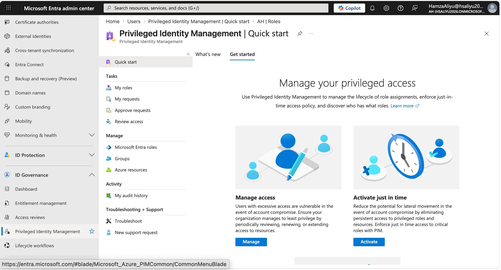
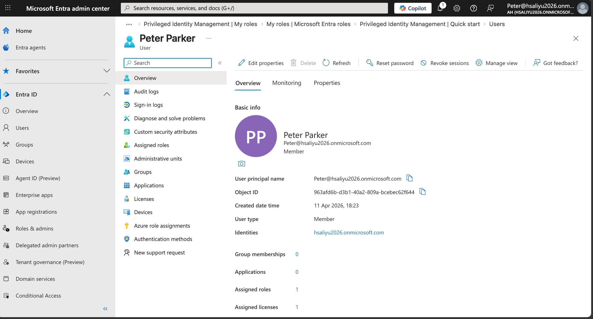
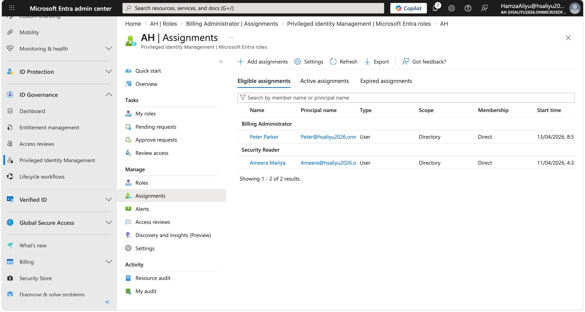
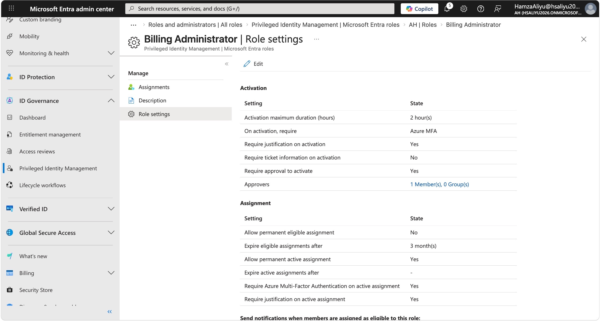
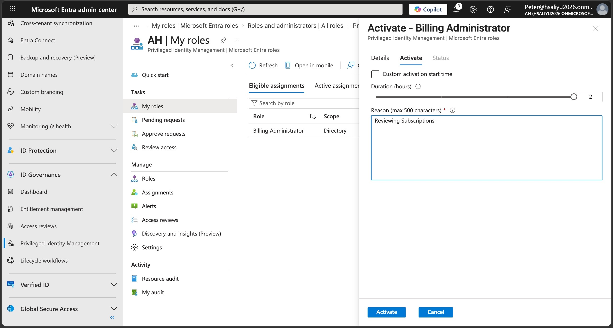
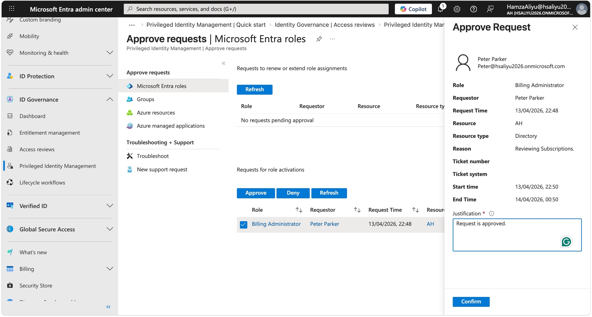
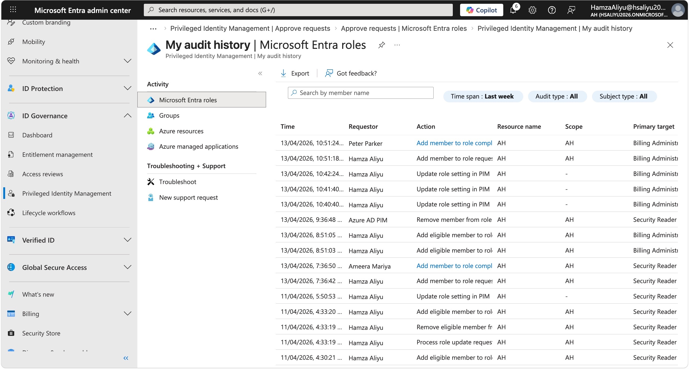

# Lab 01 — Privileged Identity Management (PIM)

## Overview

This lab demonstrates the configuration and use of Microsoft Entra Privileged Identity Management (PIM) to enforce just-in-time privileged access. Rather than assigning permanent admin roles — which significantly increases an organisation's attack surface — PIM ensures users only receive elevated access when needed, for a limited time, and with full auditability.

This is a core Zero Trust principle and a key control in reducing insider threat and credential-based attack risk.
---
## Objectives

- Enable and configure Privileged Identity Management in Microsoft Entra ID
- Assign an eligible (just-in-time) role to a test user (Peter@hsaliyu2026.onmicrosoft.com)
- Configure role activation settings, including MFA, justification, and approval requirements
- Simulate a role activation request as an end user
- Approve a PIM request as an administrator
- Review the PIM audit log for accountability and forensic visibility
---
## Tools & Services Used

- Microsoft Entra ID P2 (trial)
- Privileged Identity Management (PIM)
- Microsoft Entra admin centre (entra.microsoft.com)

---

## Prerequisites

- Microsoft Entra ID P2 trial activated
- Global Administrator role assigned to your account
- A test user account created in Entra ID

---

## Step-by-Step Walkthrough

### Step 1 — Enable PIM

Navigated to **Identity Governance → Privileged Identity Management** in the Entra admin centre.

---

### Step 2 — Create a Test User

Created a test user account in Entra ID to simulate a standard employee who requires temporary privileged access. Using a separate account reflects real-world practice and avoids testing directly with a permanent Global Administrator account.

- Navigated to **Identity → Users → New User**
- Set a display name, username, and temporary password
- Assigned the Entra ID P2 licence to the test user

---

### Step 3 — Assign an Eligible Role

Assigned the **Billing Administrator** role to the test user as an **Eligible** assignment rather than Active. This means the user does not hold the role permanently — they must explicitly request and activate it each time access is needed, and that access expires automatically.

- Navigated to **PIM → Microsoft Entra Roles → Roles**
- Selected **Billing Administrator**
- Clicked **Add assignments**
- Assignment type: **Eligible**
- Duration: **3 months**
- Member: Peter@hsaliyu2026.onmicrosoft.com

---

### Step 4 — Configure Role Activation Settings

Edited the Billing Administrator role settings in PIM to enforce strict activation controls, reflecting the principle of least privilege and defence in depth. These settings ensure that even eligible users cannot silently elevate their access — every activation must be justified, approved, and verified with MFA.

Settings configured:

- Maximum activation duration: **2 hours**
- Require justification on activation: **Enabled**
- Require MFA on activation: **Enabled**
- Require approval to activate: **Enabled**
- Approver assigned: Global Administrator account

---

### Step 5 — Activate the Role as the Test User

Opened a private browser window and signed in as the test user at entra.microsoft.com. Navigated to **Identity Governance → Privileged Identity Management → My roles** to find the eligible Billing Administrator role and submitted an activation request.

Justification entered:
*"Reviewing Subscriptions."*

The activation was placed in a pending state, awaiting administrator approval before access was granted.

---

### Step 6 — Approve the Activation Request

Switched back to the Global Administrator browser session and navigated to **PIM → Approve requests**. Reviewed the pending request from the test user, confirmed the justification was appropriate, and approved access.

This step reflects the real-world workflow where a security team lead or manager reviews and approves privileged access requests before they are granted — ensuring no one can self-approve elevated access.

---

### Step 7 — Review the Audit Log

Navigated to **PIM → Audit history** to review the complete activity trail generated by this lab. The log captured every action, including role assignment creation, activation request submission, approval decision, and access grant — providing full accountability.

In a real enterprise environment this audit trail is critical for compliance reporting, forensic investigation, and demonstrating due diligence to internal or external auditors.

---

## Key Security Concepts Demonstrated

- **Just-in-Time Access** — Privileged roles are not permanently assigned, significantly reducing the window of opportunity for attackers exploiting compromised credentials. A permanently assigned admin account that is compromised gives an attacker indefinite access; a JIT model limits the blast radius.

- **Least Privilege** — Users only receive the minimum access needed, for the minimum time required. 

- **Zero Trust Principle** — Access is never assumed safe. Every activation must be verified (MFA), justified (written reason), and approved (human review) before it is granted.

- **Defence in Depth** — Layering MFA, approval workflows, and time-limited access creates multiple independent barriers to privilege abuse. An attacker would need to bypass all three layers simultaneously.

- **Audit & Accountability** — Every action is logged with a timestamp and actor identity, supporting compliance frameworks such as ISO 27001, NIST 800-53, and CIS Controls.

---

## Challenges & How I Solved Them
Challenge 1 — Licence assignment failed due to invalid usage location
When attempting to assign the Microsoft Entra ID P2 licence to the test user (Peter Parker), the following error was returned:
"Your assignment was unsuccessful — License assignment cannot be done for user with invalid usage location."
The issue was that the test user account had no usage location set, and Microsoft requires a valid usage location on a user account before any licence can be assigned. This is because Microsoft licences are subject to regional availability and compliance requirements, so the platform needs to know which country the user is in before granting access to services.
To resolve this I navigated to:
Users → Peter Parker → Properties → Settings → Usage location
I updated the usage location to match the same location as my tenant and saved the change. After that the Entra ID P2 licence was assigned successfully.
This is worth noting for real enterprise environments — when onboarding new users, the usage location should be set during the initial account creation process, particularly in organisations with automated licence assignment policies. Missing usage locations are a common cause of licence assignment failures in bulk user provisioning scenarios.

Challenge 2 — Finding where to activate an eligible role as a user

When attempting to activate the eligible Billing Administrator role as the test user, I initially navigated to the Overview. Then I tried to access it through View Profile, assuming the activation option would be visible from there. However, the activation option was not available from that location.

After exploring the portal further, I discovered that to activate an eligible role you must navigate specifically to:

**Identity Governance → Privileged Identity Management → My roles**

From there the eligible role was listed and the Activate button was accessible. This was a useful real-world reminder that the Entra portal has a specific navigation path for user-facing PIM actions, separate from the administrator configuration views. In an enterprise environment, end users would typically be given direct instructions or a bookmarked link to this page to reduce confusion and support calls.

---

## What I Learned

- PIM is a practical, enforceable implementation of Zero Trust — not just a theoretical concept but a configurable control that directly reduces risk
- The difference between **Eligible** and **Active** role assignments, and why Eligible is the preferred approach for privileged roles in an enterprise environment
- How layering MFA, approval workflows, time limits, and justification requirements together creates a robust defence against privilege abuse
- Why permanent admin role assignments are considered a critical security risk in cloud environments and how PIM directly mitigates that risk
- How to navigate the Microsoft Entra admin centre to configure PIM from both an administrator and end-user perspective
- The importance of audit logs in demonstrating accountability and supporting compliance and forensic investigation requirements

---

## References

- [Microsoft Learn — What is Privileged Identity Management?](https://learn.microsoft.com/en-us/entra/id-governance/privileged-identity-management/pim-configure)
- [Microsoft Learn — Assign Entra roles in PIM](https://learn.microsoft.com/en-us/entra/id-governance/privileged-identity-management/pim-how-to-add-role-to-user)
- [Microsoft Learn — Configure Entra role settings in PIM](https://learn.microsoft.com/en-us/entra/id-governance/privileged-identity-management/pim-how-to-change-default-settings)
- [Microsoft Learn — Approve activation requests in PIM](https://learn.microsoft.com/en-us/entra/id-governance/privileged-identity-management/pim-approval-workflow)
- [Microsoft Learn — View audit history for Entra roles in PIM](https://learn.microsoft.com/en-us/entra/id-governance/privileged-identity-management/pim-how-to-use-audit-log)

