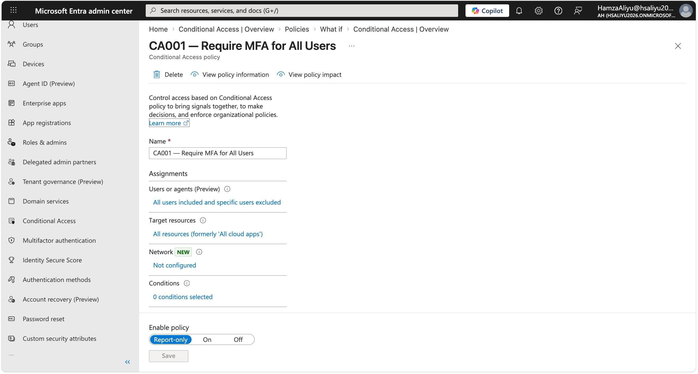
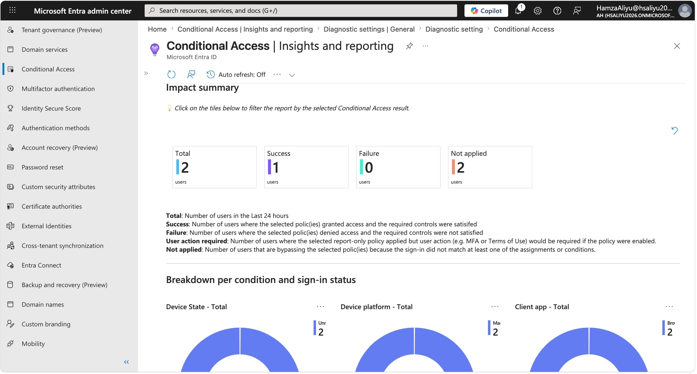
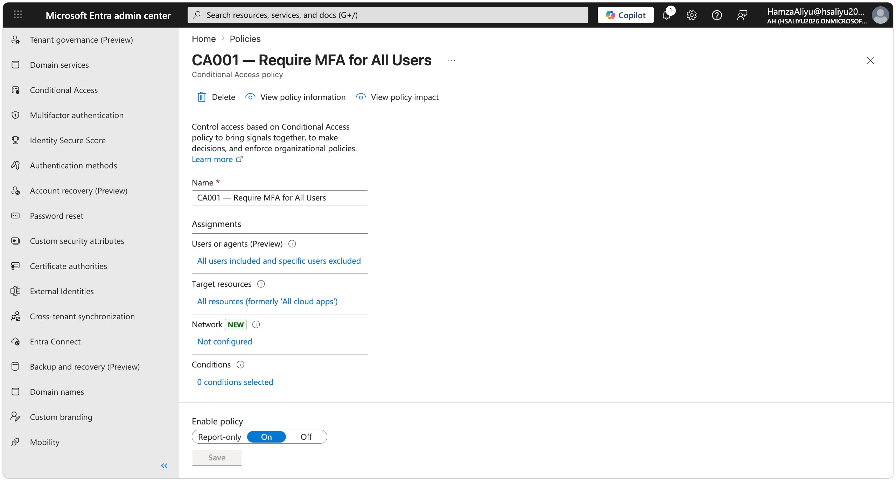
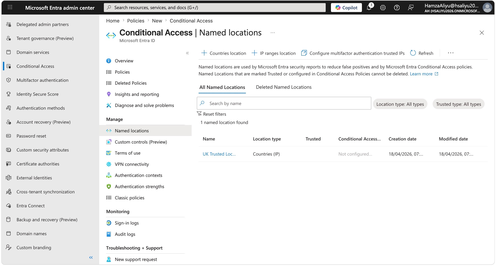
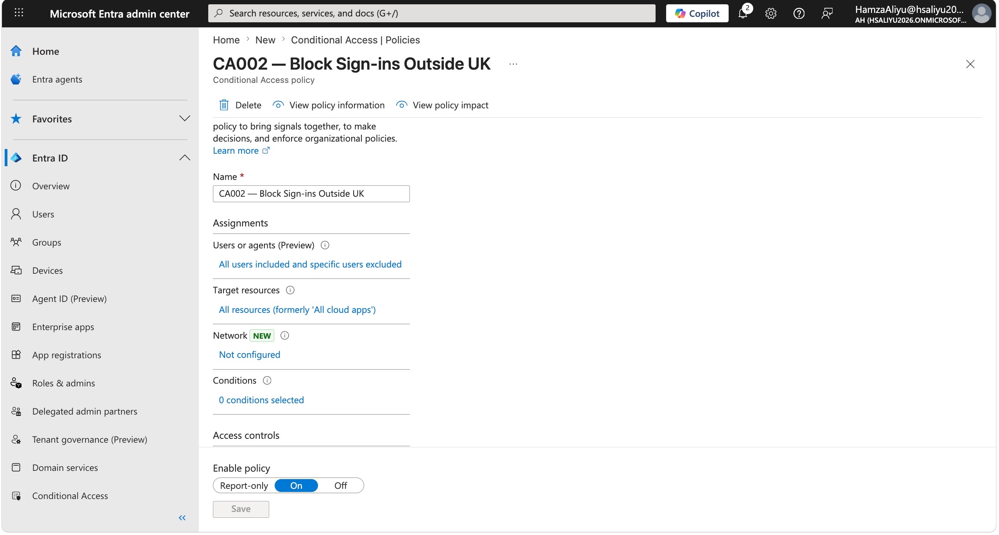
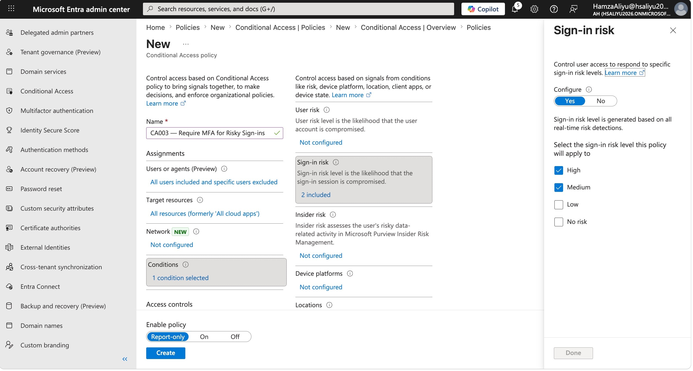
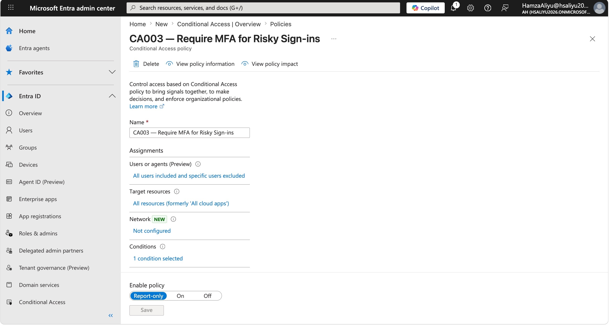
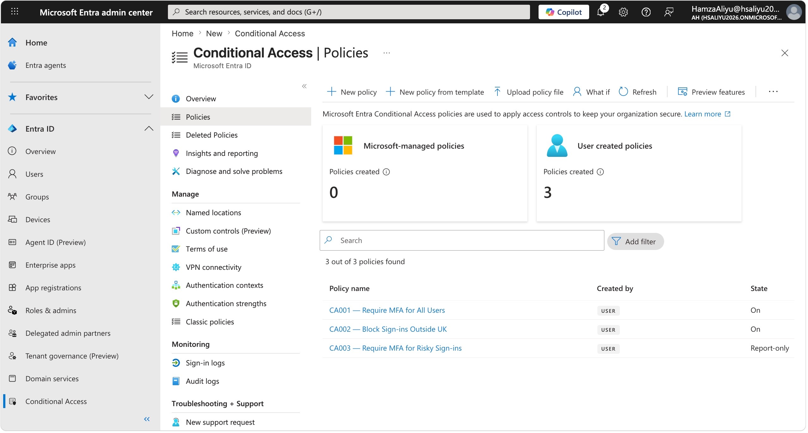

# Lab 02 — Conditional Access Policies

## Overview

This lab demonstrates the configuration of Microsoft Entra Conditional Access policies to enforce Zero Trust principles across cloud application access. Conditional Access acts as the policy engine that evaluates every sign-in attempt against a set of conditions — such as user identity, location, device state, and sign-in risk — before deciding whether to grant access, block it, or require additional verification.

Rather than trusting any user with a valid username and password, Conditional Access ensures that access decisions are dynamic, context-aware, and continuously enforced. This is a foundational control in any enterprise cloud security architecture and one of the most commonly assessed topics in UK cloud security roles.

---

## Objectives

- Disable Security Defaults to enable custom Conditional Access policy management
- Create and configure a policy requiring MFA for all users
- Define a Named Location for the United Kingdom
- Create and configure a policy blocking sign-ins from outside the UK
- Create and configure a policy requiring MFA for medium and high-risk sign-ins
- Configure a Log Analytics workspace and integrate diagnostic logs to enable Conditional Access reporting

---

## Tools & Services Used

- Microsoft Entra ID P2 (trial)
- Conditional Access
- Named Locations
- Entra ID Protection (sign-in risk)
- Conditional Access Insights and Reporting
- Azure Log Analytics Workspace
- Azure Portal (portal.azure.com)

---

## Prerequisites

- Microsoft Entra ID P2 trial activated
- Global Administrator role assigned to your account
- Test user account created and licensed from Lab 01
- Security Defaults disabled (see Challenge 1 below)

---

## Step-by-Step Walkthrough

### Step 1 — Disable Security Defaults

Before Conditional Access policies can be created and enforced, Security Defaults must be disabled. Security Defaults is Microsoft's baseline protection setting for new tenants — it applies basic MFA rules automatically, but it cannot coexist with custom Conditional Access policies.

Navigated to:
**Entra admin centre → Identity → Overview → Properties → Manage Security Defaults**

Set Security Defaults to **Disabled**, selected the reason *"My organisation is using Conditional Access"*, and saved.

> **Important:** Disabling Security Defaults removes baseline protections temporarily. Custom Conditional Access policies should be created and enabled promptly after disabling Security Defaults to avoid leaving the tenant unprotected.

---

### Step 2 — Create a Log Analytics Workspace

Conditional Access Insights and Reporting requires diagnostic logs to be streamed to a Log Analytics workspace in Azure before any data appears in the reports. Without this configuration, the Insights blade shows no data.

**Create the workspace:**

1. Navigated to **portal.azure.com**
2. Searched for **Log Analytics workspaces**
3. Clicked **Create**
4. Selected a Resource Group (or created a new one)
5. Named the workspace: `entra-lab-ca`
6. Selected the same region as my tenant
7. Clicked **Review + Create → Create**

**Connect Entra diagnostic logs to the workspace:**

8. Returned to **entra.microsoft.com**
9. Navigated to **Identity → Monitoring & health → Diagnostic settings**
10. Clicked **Add diagnostic setting**
11. Named it: `Entra-Logs`
12. Ticked the following log categories:
    - **AuditLogs**
    - **SignInLogs**
    - **NonInteractiveUserSignInLogs**
    - **RiskyUsers**
    - **UserRiskEvents**
    - **ServicePrincipalSignInLogs**
13. Under Destination, ticked **Send to Log Analytics workspace**
14. Selected the `entra-lab-ca` workspace
15. Clicked **Save**

> **Note:** After saving, it can take 15–30 minutes for logs to begin appearing in the Insights and Reporting blade. This is normal behaviour.

---

### Step 3 — Create Policy CA001: Require MFA for All Users

This is the most fundamental Conditional Access policy in any environment. MFA blocks the vast majority of credential-based attacks. In a real enterprise environment, this would be considered a non-negotiable baseline security.

1. Navigated to **Protection → Conditional Access → Policies**
2. Clicked **New policy**
3. Named the policy: `CA001 — Require MFA for All Users`

**Assignments:**
- Users: **All users**
- Exclude: My Global Administrator account *(critical — prevents lockout)*
- Target resources: **All cloud apps**

**Access controls:**
- Grant: **Grant access**
- Condition: **Require multifactor authentication**

**Enable policy:**
- Set to **Report-only** first to observe impact before enforcing
- Clicked **Create**

Reviewed the Insights and Reporting blade to observe how the policy would have applied to recent sign-ins.

After confirming expected behaviour, the policy was switched to **On**.

---

### Step 4 — Create Named Location for the United Kingdom

Before creating a location-based block policy, a Named Location must be defined to represent the trusted geography. This tells Conditional Access what "inside the UK" means.

1. In Conditional Access, I navigated to **Named locations**
2. Clicked **Countries location**
3. Named it: `UK — Trusted Location`
4. Selected **United Kingdom**
5. Left **Determine location by IP address** selected
6. Clicked **Create**

---

### Step 5 — Create Policy CA002: Block Sign-ins from Outside the UK

This policy uses the Named Location created above to block sign-ins originating outside the United Kingdom. This is a common control in UK financial services, the public sector, and regulated industries to reduce exposure to overseas threat actors.

1. Clicked **New policy**
2. Named it: `CA002 — Block Sign-ins Outside UK`

**Assignments:**
- Users: **All users**
- Exclude: My Global Administrator account
- Target resources: **All cloud apps**

**Conditions → Locations:**
- Configure: **Yes**
- Include: **Any location**
- Exclude: **Selected locations → UK — Trusted Location**

This means the policy applies to every location *except* the UK — effectively blocking all non-UK access.

**Access controls:**
- Grant: **Block access**

**Enable policy:**
- Set to **Report-only** initially
- Clicked **Create**

---

### Step 6 — Create Policy CA003: Require MFA for Risky Sign-ins

This policy integrates Conditional Access with Entra ID Protection's risk engine. When Identity Protection detects suspicious sign-in behaviour — such as sign-ins from anonymised IP addresses, impossible travel, or unfamiliar locations — it assigns a risk score. This policy intercepts medium and high risk sign-ins and requires MFA before access is granted.

This is a smarter and more adaptive control than blanket MFA because it responds to real-time threat signals rather than applying the same friction to every user every time.

1. Clicked **New policy**
2. Named it: `CA003 — Require MFA for Risky Sign-ins`

**Assignments:**
- Users: **All users**
- Exclude: My Global Administrator account
- Target resources: **All cloud apps**

**Conditions → Sign-in risk:**
- Configure: **Yes**
- Risk levels selected: **High** and **Medium**

**Access controls:**
- Grant: **Grant access**
- Condition: **Require multifactor authentication**

**Enable policy:**
- Set to **Report-only**
- Clicked **Create**

---

### Step 7 — Review All Policies and Insights

After creating all three policies, I reviewed the Conditional Access overview to confirm all policies were listed and correctly configured. Also reviewed the **Insights and Reporting** blade to see sign-in activity and how each policy applied to recent authentications.

---

## Key Security Concepts Demonstrated

- **Zero Trust Policy Engine** — Conditional Access enforces the principle of "never trust, always verify" by evaluating every sign-in against dynamic conditions rather than granting blanket access based on credentials alone

- **MFA as Baseline Control** — Requiring MFA for all users is the single highest-impact security control available in Entra ID, blocking the overwhelming majority of credential-based attacks including phishing and password spray

- **Location-Based Access Control** — Named Locations allow organisations to define trusted geographies and block access from regions where they have no business presence, reducing the attack surface from overseas threat actors

- **Risk-Based Adaptive Access** — Integrating sign-in risk signals from Entra ID Protection into Conditional Access creates an adaptive policy that responds to real-time threat intelligence rather than applying static rules

- **Report-Only Mode** — Testing policies in report-only mode before enforcement is a critical safety practice that prevents accidental lockouts and allows security teams to understand policy impact before going live

- **Security Defaults vs Conditional Access** — Security Defaults provides basic protection for tenants without P2 licences; Conditional Access provides granular, customisable, risk-aware policies for enterprise environments

- **Diagnostic Logging** — Streaming Entra logs to a Log Analytics workspace enables long-term retention, advanced querying with KQL, and integration with Microsoft Sentinel for SIEM use cases

---

## Challenges & How I Solved Them

**Challenge 1 — Started creating policies without disabling Security Defaults**

When I first navigated to Conditional Access and attempted to create policies, I did not initially realise that Security Defaults needed to be disabled first. Security Defaults and Conditional Access cannot be managed simultaneously — they are two separate access management approaches, and Microsoft does not allow custom Conditional Access policies to be enforced while Security Defaults is active.

To resolve this, I navigated to:
**Identity → Overview → Properties → Manage Security Defaults**

I set Security Defaults to **Disabled** and selected the reason *"My organisation is using Conditional Access"*. After saving, I was able to proceed to create and enforce custom policies.

This is an important real-world consideration — in any enterprise environment migrating from Security Defaults to Conditional Access, the transition must be carefully planned. Disabling Security Defaults removes baseline protections immediately, so custom Conditional Access policies should be created and tested in report-only mode in advance, then enabled at the same time Security Defaults is turned off to avoid any gap in protection.

---

**Challenge 2 — Insights and Reporting showed no data until Log Analytics was configured**

Even after gaining access to the Insights and Reporting blade, no sign-in data was visible. After researching the issue, I discovered that Conditional Access Insights and Reporting depend on diagnostic logs being streamed to an **Azure Log Analytics workspace**. Without this integration, the blade has no data source to pull from and displays empty reports.

To resolve this, I:

1. Created a Log Analytics workspace in the Azure Portal named `entra-lab-ca`
2. Navigated to **Entra admin centre → Monitoring & health → Diagnostic settings**
3. Created a new diagnostic setting to stream SignInLogs, AuditLogs, NonInteractiveUserSignInLogs, RiskyUsers, ServicePrincipalSignInLogs and UserRiskEvents to the workspace
4. Waited approximately 20 minutes for logs to begin flowing through

After the logs began ingesting, the Insights and Reporting blade populated with sign-in data and policy impact information.

This is an important architectural point for real enterprise environments — Log Analytics integration is not optional if you want visibility into Conditional Access policy effectiveness. It also sets the foundation for Microsoft Sentinel integration, as Sentinel uses the same Log Analytics workspace as its data store. Configuring this early means all future labs involving Sentinel will already have a log pipeline in place.

---

## What I Learned

- Security Defaults and Conditional Access are mutually exclusive — understanding when and how to transition between them is an important real-world skill
- Conditional Access policies should always be tested in report-only mode before enforcement to understand their impact and prevent accidental lockouts
- Always excluding break-glass or Global Administrator accounts from Conditional Access policies is a critical safety practice to prevent tenant lockout
- Log Analytics workspace integration is a prerequisite for Conditional Access reporting and also lays the foundation for Microsoft Sentinel (covered in a later lab)
- Risk-based Conditional Access is more sophisticated than static MFA requirements because it applies friction proportionally to the level of detected threat
- Named Locations are a powerful and flexible control that can be used to enforce geographic access restrictions aligned to business and compliance requirements

---

## References

- [Microsoft Learn — What is Conditional Access?](https://learn.microsoft.com/en-us/entra/identity/conditional-access/overview)
- [Microsoft Learn — Disable Security Defaults](https://learn.microsoft.com/en-us/entra/fundamentals/security-defaults#disabling-security-defaults)
- [Microsoft Learn — Require MFA for all users](https://learn.microsoft.com/en-us/entra/identity/conditional-access/howto-conditional-access-policy-all-users-mfa)
- [Microsoft Learn — Block access by location](https://learn.microsoft.com/en-us/entra/identity/conditional-access/howto-conditional-access-policy-location)
- [Microsoft Learn — Sign-in risk based Conditional Access](https://learn.microsoft.com/en-us/entra/identity/conditional-access/howto-conditional-access-policy-risk)
- [Microsoft Learn — Conditional Access Insights and Reporting](https://learn.microsoft.com/en-us/entra/identity/conditional-access/howto-conditional-access-insights-reporting)
- [Microsoft Learn — Configure diagnostic settings for Entra ID](https://learn.microsoft.com/en-us/entra/identity/monitoring-health/howto-configure-diagnostic-settings)

