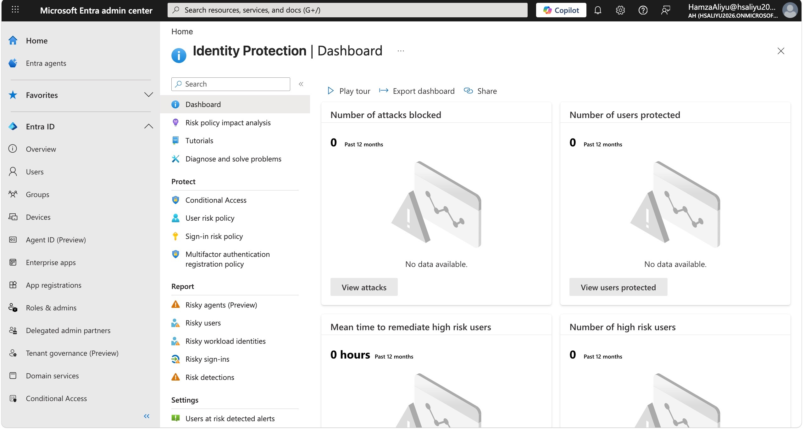
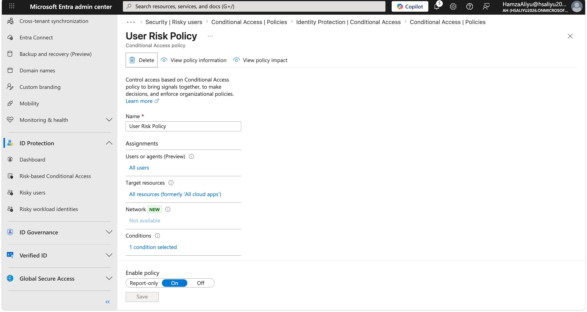
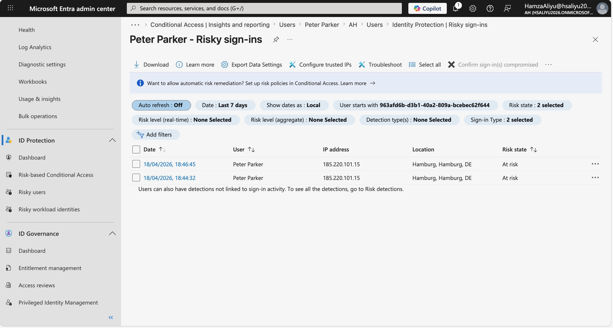
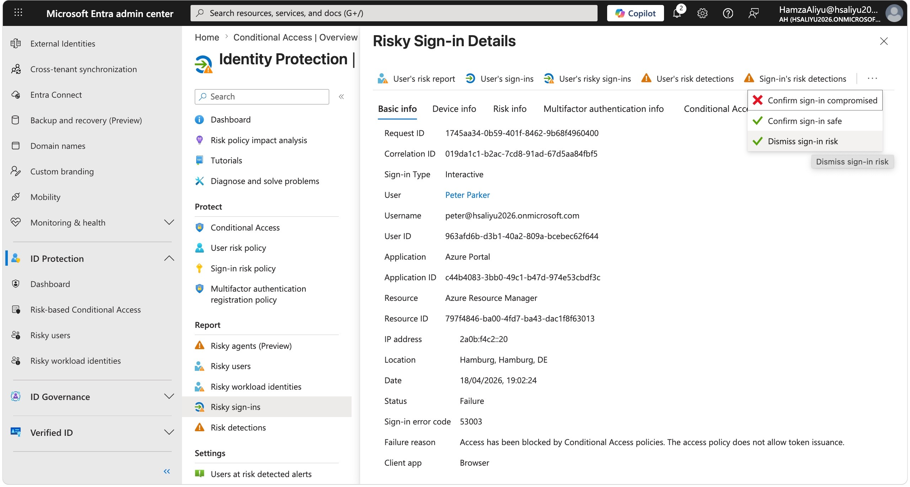
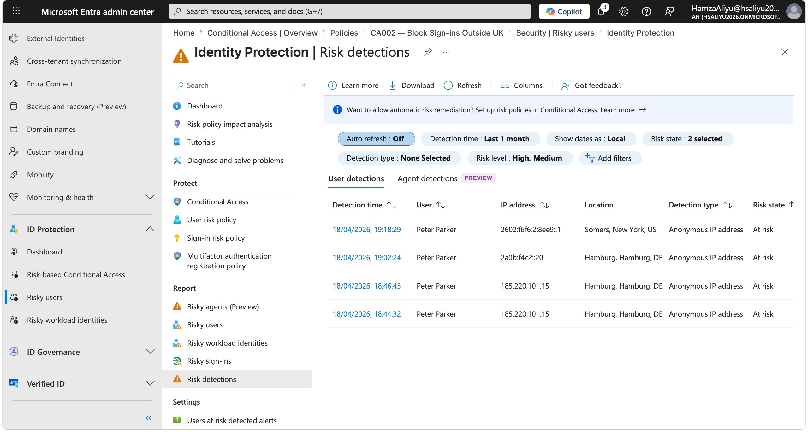
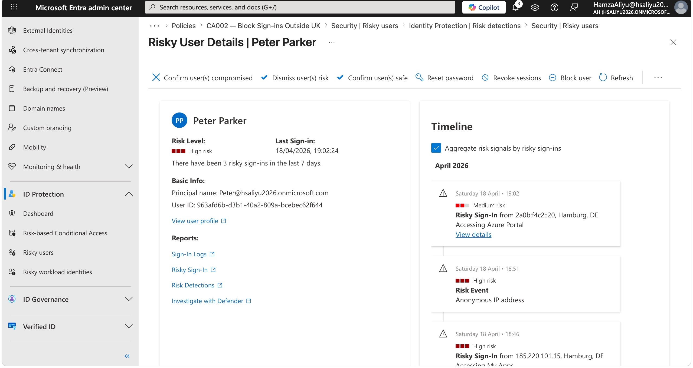

# Lab 03 — Entra ID Protection & Risk Policies

## Overview

This lab demonstrates the configuration and use of Microsoft Entra ID Protection to detect, investigate, and remediate identity-based risks. Entra ID Protection is Microsoft's threat intelligence layer for identities — it continuously analyses sign-in behaviour and user activity across Microsoft's global network, assigning risk scores when suspicious patterns are detected.

There are two types of risk evaluated:

| Risk Type | What it means | Examples |
|---|---|---|
| **Sign-in risk** | This specific sign-in looks suspicious | Anonymised IP address, impossible travel, unfamiliar location |
| **User risk** | This account may be compromised | Leaked credentials, multiple failed sign-ins, malware-linked IP |

A key discovery during this lab was that the legacy risk policy configuration within Identity Protection has been **deprecated by Microsoft**. User risk and sign-in risk controls are now managed entirely within Conditional Access, which is where all risk-based access policies should be configured going forward. This lab reflects that current architecture.

---

## Objectives

- Explore the Identity Protection dashboard and understand its key components
- Configure user risk control via Conditional Access following deprecation of legacy Identity Protection risk policies
- Confirm sign-in risk policy already implemented in Lab 02 (CA003)
- Simulate a risky sign-in using the Tor browser to trigger risk detections
- Investigate risky user and sign-in detections in the Identity Protection portal
- Remediate a risky user by dismissing risk
- Review the risk detection audit trail and risk history

---

## Tools & Services Used

- Microsoft Entra ID P2 (trial)
- Entra ID Protection
- Conditional Access (for risk policy configuration)
- Tor Browser (for sign-in risk simulation)
- Microsoft Entra admin centre (entra.microsoft.com)

---

## Prerequisites

- Microsoft Entra ID P2 trial activated
- Global Administrator role assigned
- Test user account (Peter Parker) from Lab 01
- Conditional Access policies CA001, CA002, CA003 configured from Lab 02
- Log Analytics workspace connected from Lab 02

---

## Step-by-Step Walkthrough

### Step 1 — Explore the Identity Protection Dashboard

Navigated to **Protection → Identity Protection** in the Entra admin centre to review the threat monitoring dashboard. The dashboard provides a centralised view of identity risk across the tenant, including risky users, risky sign-ins, and risk detections.

Key sections reviewed:
- **Risky users** — accounts flagged as potentially compromised
- **Risky sign-ins** — individual sign-in attempts assigned a risk score
- **Risk detections** — specific threat signals that contributed to a risk score
- **Workbook reports** — visual summaries of risk trends over time

In a real enterprise environment this dashboard would be reviewed regularly by a security analyst as part of identity threat monitoring.

---

### Step 2 — Configure User Risk Control via Conditional Access

When navigating to **Protection → Identity Protection → User risk policy**, the settings were found to be **read-only**. Microsoft has deprecated the legacy risk policy configuration within Identity Protection and migrated this functionality into Conditional Access, where all risk-based access controls are now managed.

To implement user risk control, the existing **CA003 — Require MFA for Risky Sign-ins** policy from Lab 02 was updated to also evaluate user risk levels, consolidating both risk conditions into a single policy.

1. Navigated to **Protection → Conditional Access → Policies**
2. Opened **CA003 — Require MFA for Risky Sign-ins**
3. Clicked **Edit**

**Added User Risk condition:**
- Under **Conditions → User risk** set **Configure** to **Yes**
- Selected risk level: **High**
- The existing sign-in risk condition (Medium and High) was left in place

**Updated Access controls:**
- Grant: **Grant access**
- Added: **Require password change** alongside the existing MFA requirement

4. Saved the updated policy

CA003 now enforces the following controls:

| Condition | Control enforced |
|---|---|
| Sign-in risk: Medium or High | Require MFA |
| User risk: High | Require MFA + password change |

> **Note:** Consolidating both risk conditions into a single Conditional Access policy reflects Microsoft's current recommended architecture. The legacy Identity Protection risk policies lacked the flexibility and audit integration of Conditional Access, and their deprecation moves all risk-based control into a single, consistently managed policy engine.

---

### Step 3 — Sign-in Risk Policy (Confirmed from Lab 02)

The sign-in risk policy was already implemented in Lab 02 as part of CA003, where sign-in risk levels of **Medium and High** were configured to require MFA. This configuration remained in place and was extended in Step 2 above to also cover user risk.

Navigated to **Protection → Identity Protection → Sign-in risk policy** to confirm it was displaying as read-only, consistent with the deprecation of legacy risk policies in favour of Conditional Access. No further configuration was required here.

---

### Step 4 — Simulate a Risky Sign-in Using Tor Browser

To generate real risk detections in Identity Protection, a risky sign-in was simulated using the **Tor browser**. Tor routes traffic through a network of anonymised relay nodes, and Microsoft's threat intelligence recognises Tor exit node IP addresses as a known risk signal — typically triggering an **Anonymous IP address** detection.

1. Downloaded and installed the Tor browser from **torproject.org**
2. Opened Tor and navigated to **myapps.microsoft.com**
3. Signed in as the test user (Peter Parker)
4. Completed the sign-in through the Tor browser

After completing the sign-in, returned to the Entra admin centre and waited for the risk detection to appear in Identity Protection. Risk detections can take several minutes to propagate after the sign-in event.

---

### Step 5 — Investigate the Risky User

After the Tor browser sign-in was processed by Identity Protection, the test user account was flagged as a risky user.

1. Navigated to **Protection → Identity Protection → Risky users**
2. Located Peter Parker in the list
3. Reviewed the following details:
   - Risk level assigned
   - Risk detection type: **Anonymous IP address**
   - Sign-in timestamp and location
   - Risk history for the account

This view reflects what a security analyst would see when triaging a potential account compromise. The risk level, detection type, and sign-in metadata together inform the decision on whether to confirm compromise or dismiss as a false positive.

---

### Step 6 — Remediate the Risky User

After investigating the detection and confirming this was a simulated event rather than a genuine compromise, the user risk was dismissed.

In a real environment there are three remediation options available:

| Option | When to use |
|---|---|
| **Confirm compromise** | Genuine account compromise confirmed — triggers immediate remediation and blocks the account |
| **Dismiss user risk** | Investigation confirms false positive — clears the risk flag from the account |
| **Require password reset** | Uncertain outcome — forces the user to reset their password as a precautionary measure |

For this lab, dismissed the user risk as a confirmed false positive:

1. In **Risky users** selected Peter Parker
2. Clicked **Dismiss user risk**
3. Confirmed the action

---

### Step 7 — Review the Risk Detection Audit Trail

After remediation, reviewed the risk detection audit trail to understand the full record of events generated during this lab.

1. Navigated to **Identity Protection → Risk detections**
2. Located the detection associated with the Tor browser sign-in
3. Reviewed the detection record including:
   - Detection type
   - Risk level at time of detection
   - Timestamp
   - Remediation action taken

This audit trail is critical in enterprise environments for compliance reporting and forensic investigation. It provides an evidence trail showing that a risk was detected, investigated, and acted upon — demonstrating due diligence to auditors and incident response teams.

---

### Step 8 — Review Risk History for the Test User

Finally, reviewed the complete risk history for the test user account to see the full timeline of events from detection through to remediation.

1. Navigated to **Risky users → Peter Parker**
2. Clicked the **Risk history** tab
3. Reviewed the timeline showing:
   - Risk raised following Tor browser sign-in
   - Risk level assigned

This view gives a complete picture of the identity risk lifecycle for a single user account and is the view a security team would reference during a post-incident review.

---

## Key Security Concepts Demonstrated

- **Identity Risk Intelligence** — Entra ID Protection uses Microsoft's global threat intelligence network to detect suspicious identity behaviour automatically, without requiring manual rule configuration

- **Sign-in Risk vs User Risk** — These are distinct risk signals that must be managed separately. Sign-in risk evaluates individual authentication events; user risk evaluates the overall state of an account over time

- **Deprecation of Legacy Risk Policies** — Microsoft has migrated risk-based access control from Identity Protection's standalone policy engine into Conditional Access, reflecting a move towards a unified, auditable policy management experience

- **Risk-Based Remediation** — Security teams must assess each risk detection and choose an appropriate response: confirm compromise, dismiss as false positive, or enforce precautionary remediation. The choice has direct impact on user experience and security posture

- **Audit Trail and Accountability** — Every risk detection, investigation, and remediation action is logged with timestamps and actor identity, supporting compliance frameworks such as ISO 27001 and NIST 800-53

- **Tor as a Risk Signal** — Anonymous IP addresses including Tor exit nodes are recognised by Microsoft's threat intelligence as a high-confidence risk indicator, commonly used in penetration testing and red team exercises to simulate attacker behaviour

---

## Challenges & How I Solved Them

**Challenge 1 — User Risk Policy was read-only due to Microsoft deprecation**

When navigating to **Identity Protection → User risk policy** to configure risk-based controls, the policy settings were read-only and could not be edited. After investigating, I discovered that Microsoft has deprecated the legacy risk policy configuration within Identity Protection and moved this functionality into Conditional Access.

To resolve this I updated the existing **CA003 — Require MFA for Risky Sign-ins** Conditional Access policy to include a user risk condition set to **High**, with grant controls requiring both MFA and a password change. This consolidated both sign-in risk and user risk controls into a single Conditional Access policy, which reflects Microsoft's current recommended architecture.

---

## What I Learned

- Entra ID Protection provides automated, intelligence-driven identity risk detection without requiring manual rule creation — a significant advantage over purely rule-based security tools
- Microsoft has deprecated legacy risk policies within Identity Protection in favour of Conditional Access, and understanding this architectural shift is important for anyone working with Entra ID in a real environment
- The distinction between sign-in risk (per-authentication) and user risk (per-account) determines the appropriate remediation response and the controls that should be applied
- Simulating risk using the Tor browser is a practical way to generate real detections in a lab environment, reflecting techniques used in penetration testing and red team exercises
- The risk history and audit trail in Identity Protection provide the evidence chain needed for incident response, compliance reporting, and post-incident review
- Dismissing risk vs confirming compromise are consequential decisions — confirming compromise triggers immediate remediation actions that would impact a real user's access

---

## References

- [Microsoft Learn — What is Entra ID Protection?](https://learn.microsoft.com/en-us/entra/id-protection/overview-identity-protection)
- [Microsoft Learn — Risk-based Conditional Access policies](https://learn.microsoft.com/en-us/entra/id-protection/howto-identity-protection-configure-risk-policies)
- [Microsoft Learn — Investigate risk with Identity Protection](https://learn.microsoft.com/en-us/entra/id-protection/howto-identity-protection-investigate-risk)
- [Microsoft Learn — Remediate risks and unblock users](https://learn.microsoft.com/en-us/entra/id-protection/howto-identity-protection-remediate-unblock)
- [Microsoft Learn — Risk detections reference](https://learn.microsoft.com/en-us/entra/id-protection/concept-identity-protection-risks)

