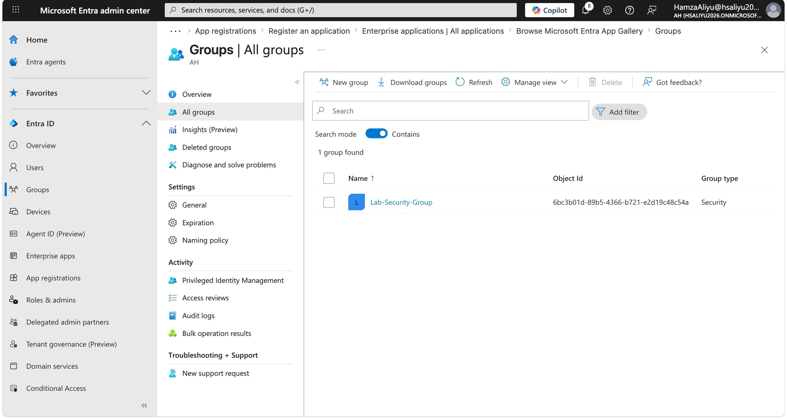
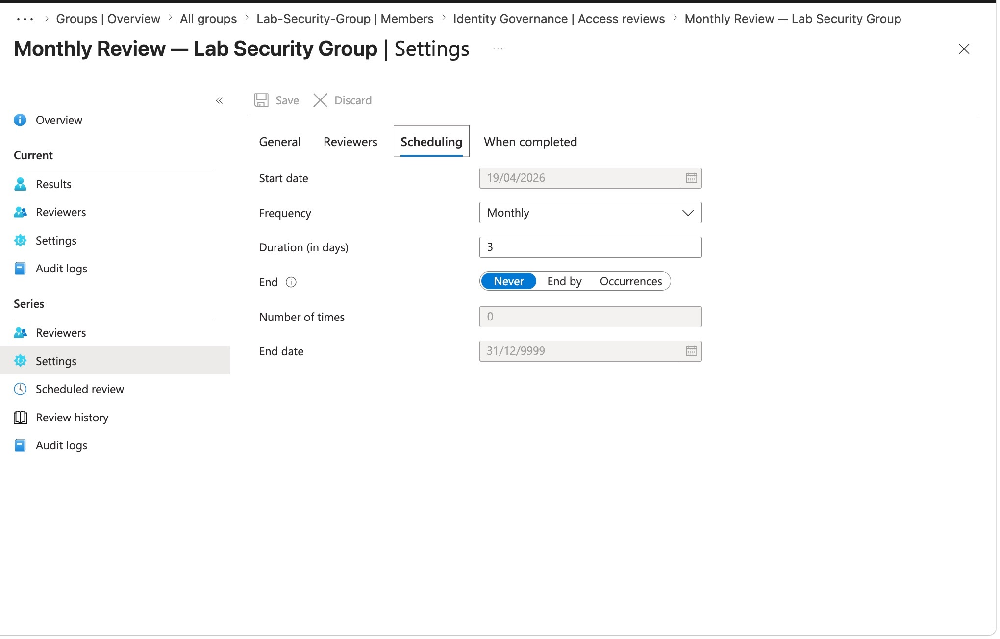
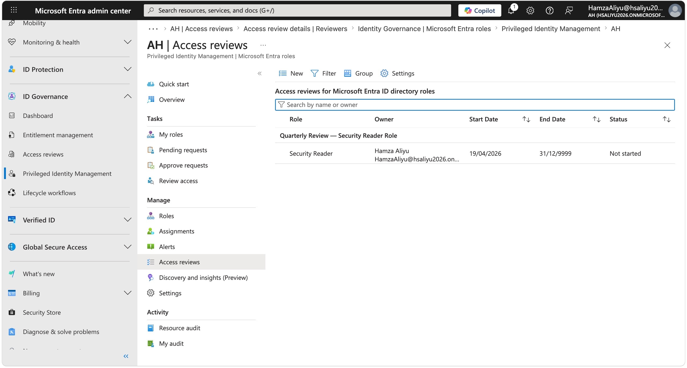
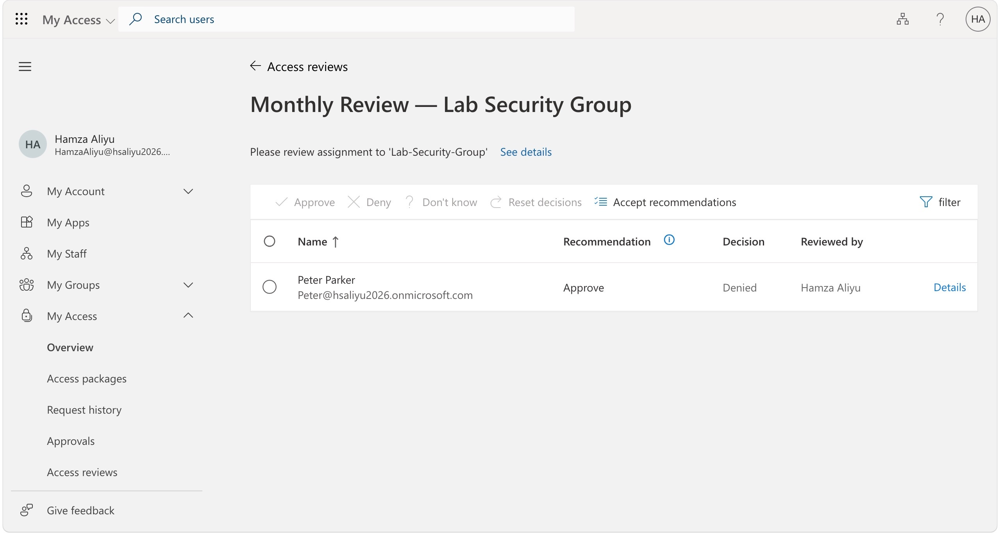
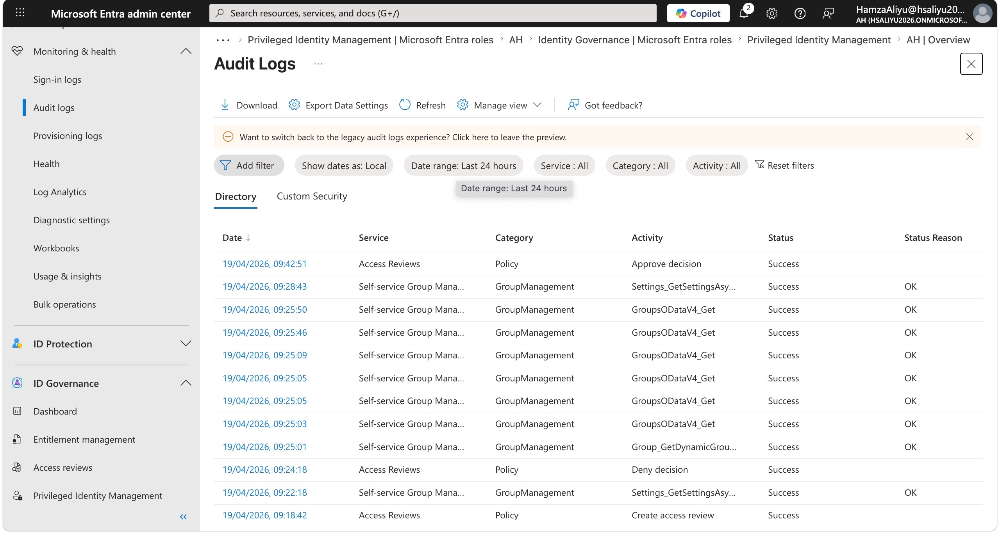

# Lab 04 — Access Reviews

## Overview

This lab demonstrates the configuration and use of Microsoft Entra Access Reviews to enforce periodic review of user access rights and privileged role assignments. In any organisation, user access tends to grow over time and rarely shrinks naturally — people change roles, move teams, or leave the company, but their access often remains in place. This is known as **access creep** and is one of the most common findings in security audits.

Access Reviews provides a structured, auditable process for periodically validating that access is still appropriate, and automatically removing it when it is not. This directly supports the principle of least privilege and is a key requirement in compliance frameworks widely referenced in UK security roles, including ISO 27001, SOC 2, and Cyber Essentials Plus.

---

## Objectives

- Create a security group and configure a recurring group membership access review
- Configure a privileged role access review via PIM (following discovery that role reviews are not available in the standard Access Reviews interface)
- Perform a reviewer decision to deny access with justification
- Configure auto-apply to ensure denied access is removed automatically when the review period closes
- Review the audit log for access review activity
- Understand the review lifecycle including when results are applied and review history populates

---

## Tools & Services Used

- Microsoft Entra ID P2 (trial)
- Identity Governance — Access Reviews
- Privileged Identity Management (PIM) — for role-based access reviews
- Microsoft Entra admin centre (entra.microsoft.com)

---

## Prerequisites

- Microsoft Entra ID P2 trial activated
- Global Administrator and Privileged Role Administrator roles assigned
- Test user account (Peter Parker) from Lab 01
- PIM configured from Lab 01

---

## Step-by-Step Walkthrough

### Step 1 — Create a Security Group

Before creating an access review a security group was needed to act as the subject of the review. A new group was created with the test user added as a member, simulating a real-world scenario where a user has been granted access to a group and that access needs periodic validation.

1. Navigated to **Identity → Groups → New group**
2. Group type: **Security**
3. Name: `Lab-Security-Group`
4. Added Peter Parker as a member
5. Clicked **Create**

---

### Step 2 — Create a Group Membership Access Review

Navigated to **Identity Governance → Access Reviews → New access review** to create a recurring review of the Lab-Security-Group membership.

**Review scope:**
- What to review: **Teams + Groups**
- Selected: `Lab-Security-Group`

**Reviewers tab:**
- Reviewers: Selected myself as the designated reviewer
- Duration: **3 days**
- Frequency: **Monthly**
- End: **Never**

**When completed tab:**
- If reviewers don't respond: **Remove access** — ensures stale access is cleaned up even if reviewers are inactive
- Auto apply results to resource: **Enabled** — automatically removes denied users when the review period closes without requiring manual intervention
- Require reason on approval: **Enabled** — reviewers must justify why access should continue

**Review named:** `Monthly Review — Lab Security Group`

The scheduling settings confirmed the review started on **19/04/2026** with a 3-day duration, meaning the review period closes on **22/04/2026** at which point auto-apply will process the decisions and remove any denied users from the group.

---

### Step 3 — Create a Privileged Role Access Review via PIM

When attempting to create an access review for a privileged Entra ID role (Security Reader) via **Identity Governance → Access Reviews → New access review**, the interface only presented options for **Teams + Groups** and **Applications**. There was no option to select Entra ID roles from this location.

After investigating, the correct navigation path for role-based access reviews was found within PIM:

**Identity Governance → Privileged Identity Management → Manage → Microsoft Entra roles → Access reviews → New**

From here a role-specific access review was created:

**Review scope:**
- Role: **Security Reader**

**Reviewers tab:**
- Reviewers: Selected myself as reviewer
- Duration: **3 days**
- Frequency: **Quarterly** — privileged role reviews are typically performed quarterly in enterprise environments to balance security rigour with operational overhead

**When completed tab:**
- If reviewers don't respond: **Remove access**
- Auto apply results to resource: **Enabled**

**Review named:** `Quarterly Review — Security Reader Role`

---

### Step 4 — Perform the Review — Deny Access for Test User

Navigated to the active review to perform the reviewer decision for Peter Parker. This simulates the experience a manager or team lead would have when receiving an access review notification and being asked to validate whether a user's access is still appropriate.

1. Navigated to **myaccess.microsoft.com**
2. Clciked on **My Access Overview**
2. Opened `Monthly Review — Lab Security Group`
3. Located Peter Parker in the review list
4. Selected **Deny**
5. Entered justification: *"Test user no longer requires access to this group for current responsibilities"*
6. Clicked **Submit**

The denial decision was recorded against the review. Because auto-apply is enabled, Peter Parker will be automatically removed from the group when the 3-day review period expires on 22/04/2026.

---

### Step 5 — Understanding the Review Lifecycle

After submitting the denial decision and checking the group membership, Peter Parker was still showing as a member of Lab-Security-Group. After investigating the review settings, this was confirmed to be expected behaviour and not a misconfiguration.

**Why the user is still in the group:**

The review was created with a **3-day duration starting 19/04/2026**, meaning the review period is still active. Access Reviews does not apply decisions during an active review period — results are only processed when one of the following occurs:

- The review duration expires (in this case 22/04/2026)
- An administrator manually triggers **Apply results** after the review closes

Because **Auto apply results to resource** is enabled, Peter Parker will be automatically removed from the group on 22/04/2026 without any further manual action required.

**Why Review History is empty:**

Review history only populates after a complete review cycle has finished. Since the first cycle has not yet closed, the history tab is empty. It will populate with the completed review record after 22/04/2026.

This is important to understand in enterprise environments — access reviews are not instant. They operate on a defined schedule and results are applied at the end of the review period. Security teams should account for this lag when planning access review timelines for compliance purposes.

---

### Step 6 — Review the Audit Log

Although the review cycle had not yet completed, audit log entries were already being generated for review creation and reviewer decisions. This confirms that all access review activity is captured in real time regardless of whether the review period has closed.

1. Navigated to the review: **Identity Governance → Access Reviews → Monthly Review — Lab Security Group**
2. Clicked **Audit logs** in the left menu
3. Reviewed log entries showing:
   - Review creation event
      - Reviewer decision (deny) submitted for Peter Parker
   - Timestamps and actor identity for each action

In a real enterprise environment this audit trail is what a compliance team or external auditor would request to demonstrate that access reviews are being conducted, decisions are being made, and the process is functioning as intended.

---

## Key Security Concepts Demonstrated

- **Access Creep Prevention** — Without periodic access reviews, user permissions accumulate over time as people change roles and responsibilities. Access Reviews enforces a structured, recurring validation process to keep permissions aligned with current business need

- **Principle of Least Privilege** — Regularly reviewing and removing unnecessary group memberships and role assignments ensures users hold only the access they actively need, reducing the attack surface available to an attacker with compromised credentials

- **Auto-Remediation** — Configuring auto-apply and default removal for non-responsive reviewers ensures that access is removed even when reviewers fail to act, preventing the review process from becoming a rubber-stamp exercise

- **Role Reviews via PIM** — Privileged role access reviews are managed separately through PIM rather than the standard Access Reviews interface, reflecting the elevated sensitivity of role assignments compared to group memberships

- **Review Lifecycle Awareness** — Access review results are not applied instantly. They are processed at the end of the defined review period, which is important to understand when planning compliance timelines and communicating expectations to stakeholders

- **Audit Trail for Compliance** — Every access review action is captured in audit logs in real time, providing the evidence chain required by frameworks such as ISO 27001, SOC 2, and Cyber Essentials Plus

---

## Challenges & How I Solved Them

**Challenge 1 — Role access reviews not available in the standard Access Reviews interface**

When navigating to **Identity Governance → Access Reviews → New access review** to create a review for the Security Reader role, the interface only offered two options: **Teams + Groups** and **Applications**. There was no option to select Microsoft Entra ID roles from this location.

After investigating further, I discovered that privileged role access reviews are managed through a separate path within PIM:

**Identity Governance → Privileged Identity Management → Manage → Microsoft Entra roles → Access reviews → New**

From this location I was able to create a role-scoped access review targeting the Security Reader role. This separation makes architectural sense — role assignments carry significantly more risk than group memberships and are governed through PIM, so their review process is also managed within that context.

This is worth noting for real enterprise environments and certification exams — role access reviews and group access reviews are configured in different parts of the portal, and understanding this distinction is important for anyone responsible for identity governance.

---

**Challenge 2 — Apply results option unavailable and review history empty**

After submitting the denial decision for Peter Parker and checking the group membership, the test user was still showing as a member of Lab-Security-Group. Additionally, the **Apply results** option was not visible and the **Review history** tab was empty.

After reviewing the access review settings, I identified that the review was configured with a **3-day duration starting 19/04/2026**, meaning the review period is still active and will not close until **22/04/2026**.

Access Reviews only processes and applies decisions after the review period has expired. Because **Auto apply results to resource** was enabled during review creation, Peter Parker will be automatically removed from the group when the review closes on 22/04/2026 — no further action is required.

Review history will also populate after that first cycle completes. An empty history tab during an active review period is expected behaviour, not an error.

This was a valuable reminder that access governance controls operate on defined schedules rather than in real time, and that security teams need to plan review timelines accordingly when working towards compliance deadlines.

---

## What I Learned

- Access Reviews is a critical identity governance control that directly addresses access creep — one of the most common findings in enterprise security audits
- Privileged role access reviews must be created through PIM rather than the standard Access Reviews interface — an important distinction that is not clearly signposted in the portal
- Auto-apply and default removal settings are essential to make access reviews meaningful — without them, denied decisions require manual follow-up and are easily overlooked
- Access review results are processed at the end of the review period, not in real time — understanding this lifecycle is important for compliance planning and stakeholder communication
- Audit logs capture review activity in real time even before a review cycle completes, providing immediate evidence of the governance process being followed
- Recurring reviews (monthly for groups, quarterly for privileged roles) reflect real-world enterprise practice and align with requirements in ISO 27001, SOC 2, and Cyber Essentials Plus

---

## Pending — To Capture After 22/04/2026

Once the review period closes the following should be verified and documented:

- Peter Parker has been automatically removed from Lab-Security-Group
- Review history has populated with the completed cycle record

---

## References

- [Microsoft Learn — What are Access Reviews?](https://learn.microsoft.com/en-us/entra/id-governance/access-reviews-overview)
- [Microsoft Learn — Create an access review of groups and applications](https://learn.microsoft.com/en-us/entra/id-governance/create-access-review)
- [Microsoft Learn — Create an access review of Entra roles in PIM](https://learn.microsoft.com/en-us/entra/id-governance/privileged-identity-management/pim-create-roles-and-resource-roles-review)
- [Microsoft Learn — Review access to groups and applications](https://learn.microsoft.com/en-us/entra/id-governance/perform-access-review)
- [Microsoft Learn — Complete an access review](https://learn.microsoft.com/en-us/entra/id-governance/complete-access-review)

