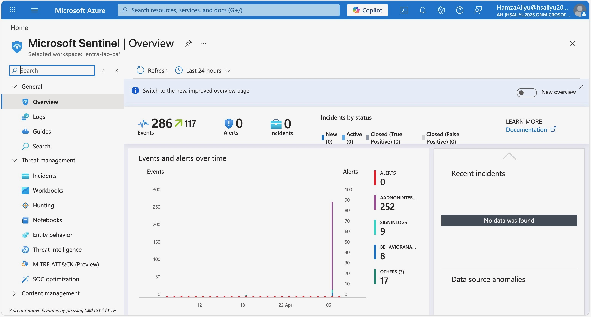
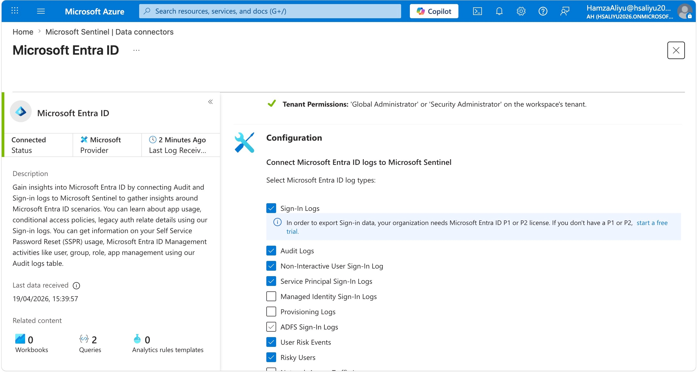
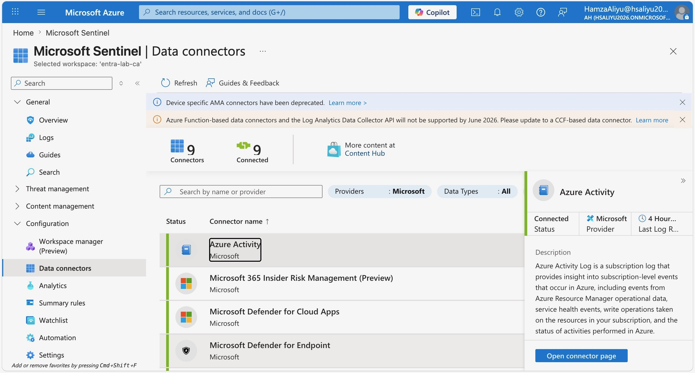
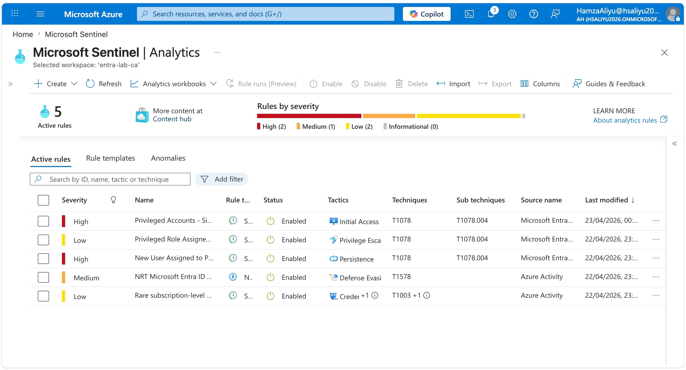
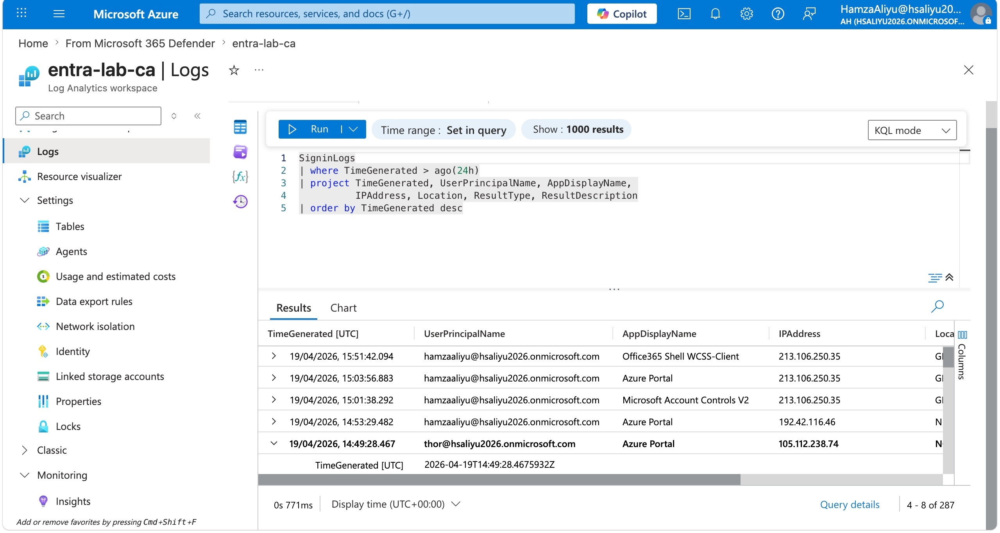
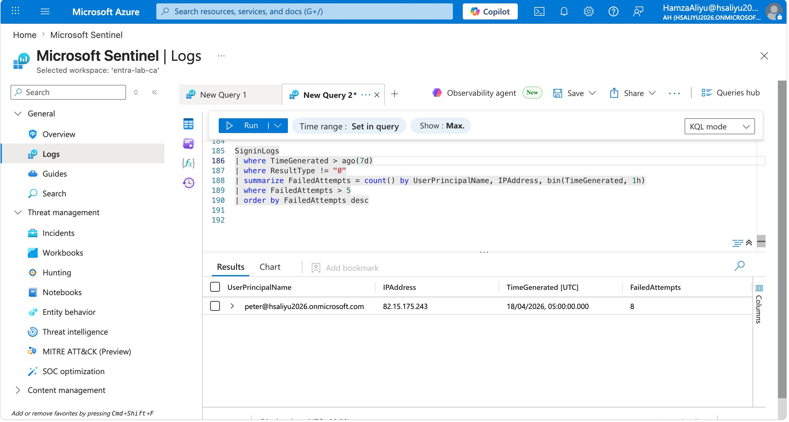
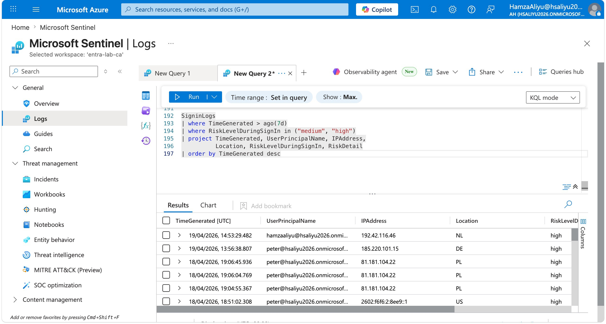
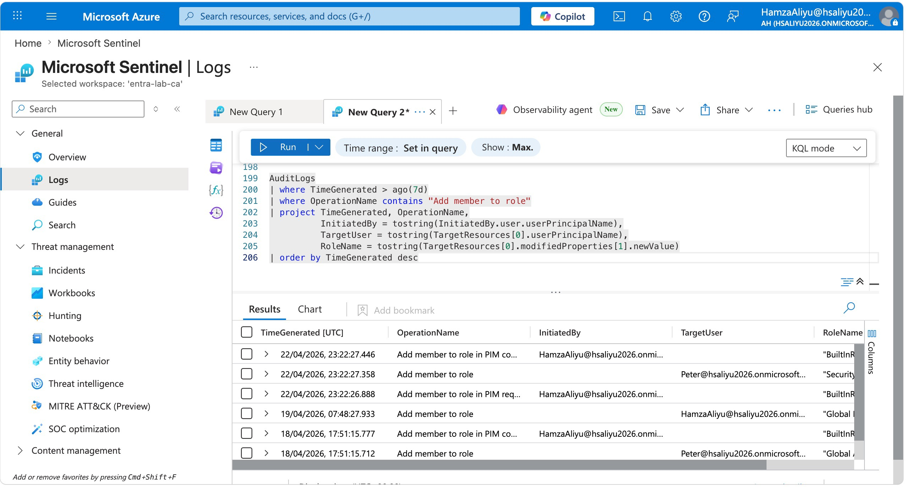

# Lab 05 — Microsoft Sentinel: Deployment, Data Connectors, and Threat Detection

## Overview

This lab demonstrates the deployment and configuration of Microsoft Sentinel as a cloud-native SIEM (Security Information and Event Management) and SOAR (Security Orchestration, Automation and Response) platform. Sentinel collects security data from across the environment, detects threats using analytics rules, enables threat hunting through KQL queries, and can respond automatically using playbooks.

A key architectural discovery during this lab was that the Log Analytics workspace and diagnostic settings configured in Lab 02 had already established the log ingestion pipeline. When Sentinel was deployed on top of the same workspace, it immediately had access to Entra ID sign-in logs, audit logs, risk events, and other log categories — without requiring additional connector configuration. This demonstrates the value of building a solid logging foundation early.

This lab also documents an important platform development: during the lab, a notification was observed in the Sentinel overview indicating that **Sentinel will migrate exclusively to the Microsoft Defender portal by March 2027**. The unified Defender portal combines Sentinel SIEM capabilities with Defender XDR for a consolidated security operations experience. Navigating to **defender.microsoft.com → Settings → Microsoft Sentinel** confirmed the workspace was already connected. Awareness of Microsoft's strategic platform direction is directly relevant to anyone working in a cloud security role.


---

## Objectives

- Deploy Microsoft Sentinel on the existing Log Analytics workspace from Lab 02
- Understand how pre-existing diagnostic settings automatically populate Sentinel with Entra ID log data
- Connect the Azure Activity data connector via Content Hub and work through the full troubleshooting journey to achieve a connected status
- Enable and manage analytics rules for threat detection
- Write and execute four KQL threat hunting queries covering real-world security scenarios
- Note the Sentinel migration to the Microsoft Defender unified portal

---

## Tools & Services Used

- Microsoft Sentinel
- Azure Log Analytics Workspace (`entra-lab-ca`)
- Microsoft Entra ID (as a log source)
- Azure Monitor — Activity Log (for subscription-level log export)
- Azure Policy (used by Azure Activity connector wizard)
- KQL — Kusto Query Language
- Microsoft Defender portal (defender.microsoft.com)
- Azure Portal (portal.azure.com)

---

## Prerequisites

- Log Analytics workspace (`entra-lab-ca`) created and configured in Lab 02
- Entra ID diagnostic settings already streaming logs to the workspace
- Owner role assigned on the Azure subscription
- Global Administrator and Privileged Role Administrator roles assigned

---

## Step-by-Step Walkthrough

### Step 1 — Deploy Microsoft Sentinel

Navigated to **portal.azure.com** and searched for **Microsoft Sentinel**. Clicked **Create Microsoft Sentinel** and selected the existing Log Analytics workspace `entra-lab-ca` created in Lab 02.

Clicked **Add** and waited approximately 1–2 minutes for deployment to complete. Once deployed, the Sentinel overview page loaded showing the incident queue, data ingestion statistics, and connected data sources.

Upon loading the overview page, a notification banner was displayed:

> *"Sentinel is moving to the Defender portal. After March 31, 2027, Sentinel will only be available in the Defender portal."*

This confirms Microsoft's strategic direction to unify SIEM and XDR capabilities within the Microsoft Defender portal. Navigating to **defender.microsoft.com → Settings → Microsoft Sentinel** confirmed the workspace was already connected to the Defender portal, meaning all Sentinel data, analytics rules, and incidents are accessible from both portals during the transition period.



---

### Step 2 — Entra ID Data Connector (Pre-Configured via Diagnostic Settings)

When navigating to **Configuration → Data connectors** and opening the **Microsoft Entra ID** connector, all log categories were already ticked and the connector was showing as connected. No additional configuration was required.

This was because the diagnostic settings configured in Lab 02 had already established a pipeline streaming the following log types into the `entra-lab-ca` workspace:

- Sign-in logs
- Audit logs
- Non-interactive user sign-in logs
- Risky users
- User risk events

When Sentinel was deployed on top of the same workspace, it automatically recognised these existing log streams and surfaced them through the Entra ID connector. This is a direct demonstration of how the Log Analytics workspace acts as the central data store — Sentinel is the security analytics and investigation layer that sits on top of logs that were already flowing.

This is an important architectural principle for real enterprise environments: establishing a centralised logging pipeline as a foundational control means SIEM tools can be onboarded without reconfiguring log sources from scratch, reducing deployment risk and time.



---

### Step 3 — Azure Activity Data Connector

The Azure Activity connector was not immediately visible in the Data Connectors list. The correct approach was to locate it via Content Hub:

**Microsoft Sentinel → Content management → Content hub → Search "Azure Activity" → Install → Open connector page**

After installing the content package, the connector configuration wizard was launched. The wizard uses **Azure Policy** to create a diagnostic setting routing Azure subscription activity logs to the Sentinel workspace.

The connector remained disconnected after the wizard completed. A full troubleshooting process was undertaken — documented in full in the Challenges section below.

**Resolution:** The connector was successfully connected by creating a subscription-level diagnostic setting directly via:

**Azure Portal → Monitor → Activity log → Export Activity Logs → Add diagnostic setting**

The setting was configured to send all Azure Activity log categories to the `entra-lab-ca` workspace. After saving, the connector updated to **Connected** status with logs confirmed as received. The final Sentinel Data connectors page showed **9 connectors, 9 connected**.



---

### Step 4 — Analytics Rules

**Part 1 — Initial rule templates from Azure Activity**

Navigated to **Configuration → Analytics → Rule templates**. The initial rule templates visible were sourced from the Azure Activity connector — covering subscription-level operations such as rare subscription activity and Azure resource defence evasion. Two rules were enabled from this source: an NRT Microsoft Entra ID rule (Medium) and a Rare subscription-level operation rule (Low).

**Part 2 — Installing the Microsoft Entra ID solution from Content Hub**

When searching for sign-in related detection rules in the Rule templates list, no results were returned. Investigation revealed that the Microsoft Entra ID analytics rule templates are packaged separately and need to be installed via Content Hub.

Navigated to:
**Content management → Content hub → Search "sign" → Microsoft Entra ID solution**

The Microsoft Entra ID solution for Sentinel was identified as a Featured solution from Microsoft containing:
- 1 data connector
- 73 analytics rule templates
- 3 workbooks
- 11 playbooks

Clicked **Install** and waited for the installation to complete. After installation, returning to **Rule templates** and searching for `sign` now returned a comprehensive list of identity-focused detection rules sourced from Microsoft Entra ID.

**Part 3 — Enabling analytics rules**

Three additional rules were selected and enabled, chosen specifically because they connect directly to the identity controls built in Labs 01 through 04:

| Rule | Severity | Why selected |
|---|---|---|
| New User Assigned to Privileged Role | High | Detects privilege grants — directly relevant to PIM work in Lab 01 |
| Privileged Role Assigned Outside PIM | Low | Detects privilege escalation bypassing PIM controls |
| Privileged Accounts — Sign in Failure Spikes | High | Detects brute force against admin accounts — connects to KQL Query 2 |

Each rule was enabled by clicking **Create rule** from the Rule templates panel and accepting the default configuration settings before clicking **Create**.

The final Active rules list showed **5 rules enabled** across High, Medium, and Low severity — all with Enabled status and immediately evaluating against the existing log data already present in the workspace.



---

### Step 5 — KQL Threat Hunting Queries

Navigated to **General → Logs** in Microsoft Sentinel to write and execute KQL queries against the ingested log data. All four queries returned results, confirming the log pipeline established in Lab 02 was successfully feeding data into Sentinel.

---

**Query 1 — All Sign-in Events (Last 24 Hours)**

Purpose: Baseline visibility query providing an overview of all authentication activity across the tenant. Used as the starting point for any identity-focused investigation.

```kql
SigninLogs
| where TimeGenerated > ago(24h)
| project TimeGenerated, UserPrincipalName, AppDisplayName,
          IPAddress, Location, ResultType, ResultDescription
| order by TimeGenerated desc
```

Results confirmed sign-in activity from both the administrator account and test user Peter Parker, including sign-ins from the Tor browser session conducted in Lab 03.



---

**Query 2 — Failed Sign-in Attempts (Brute Force Detection)**

Purpose: Identifies accounts with more than five failed sign-in attempts within a one-hour window — a key indicator of brute force or password spray attacks.

```kql
SigninLogs
| where TimeGenerated > ago(24h)
| where ResultType != "0"
| summarize FailedAttempts = count() by UserPrincipalName, IPAddress, bin(TimeGenerated, 1h)
| where FailedAttempts > 5
| order by FailedAttempts desc
```

In a production environment this query surfaces accounts under active attack. In the lab it returned results corresponding to failed authentication attempts generated during testing across previous labs.



---

**Query 3 — Risky Sign-ins from Identity Protection**

Purpose: Surfaces sign-in events that Entra ID Protection flagged as medium or high risk — directly connecting the Identity Protection work from Lab 03 into Sentinel's threat hunting capability.

```kql
SigninLogs
| where TimeGenerated > ago(7d)
| where RiskLevelDuringSignIn in ("medium", "high")
| project TimeGenerated, UserPrincipalName, IPAddress,
          Location, RiskLevelDuringSignIn, RiskDetail
| order by TimeGenerated desc
```

Results included the Tor browser sign-in from Lab 03 which was flagged as an **Anonymous IP address** detection — confirming the end-to-end pipeline from Identity Protection risk detection through to Sentinel threat hunting.



---

**Query 4 — Privileged Role Assignments (Privilege Escalation Detection)**

Purpose: Tracks every privileged role assignment in the tenant — a critical detection for identifying unauthorised privilege escalation. Directly relevant to the PIM configuration from Lab 01.

```kql
AuditLogs
| where TimeGenerated > ago(7d)
| where OperationName contains "Add member to role"
| project TimeGenerated, OperationName,
          InitiatedBy = tostring(InitiatedBy.user.userPrincipalName),
          TargetUser = tostring(TargetResources[0].userPrincipalName),
          RoleName = tostring(TargetResources[0].modifiedProperties[1].newValue)
| order by TimeGenerated desc
```

Results returned a full audit trail of role assignments made across Labs 01 through 04 — including PIM role assignments, the Privileged Role Administrator assignment, and Conditional Access-related role changes.



---

## Key Security Concepts Demonstrated

- **SIEM Architecture** — Sentinel acts as a security analytics and investigation layer on top of Log Analytics. The workspace is the data store; Sentinel provides detection, investigation, and response capabilities on top of it

- **Log Pipeline Reuse** — Diagnostic settings established in an earlier lab automatically populated Sentinel with data upon deployment, demonstrating the value of building centralised logging infrastructure before deploying SIEM tooling

- **Subscription-Level vs Resource-Level Diagnostic Settings** — Azure Activity logs are a subscription-level resource and must be exported via Monitor → Activity log, not through resource-level diagnostic settings. 

- **Azure Policy Scoping** — The Azure Activity connector wizard scopes its policy assignment to a resource group by default, which is insufficient for subscription-level log capture. Understanding policy scope is essential for enterprise Sentinel deployments

- **KQL for Threat Hunting** — Kusto Query Language is the core skill for working with Sentinel. The four queries cover the most common real-world detection scenarios: baseline visibility, brute force detection, risk-based alerting, and privilege escalation tracking

- **Analytics Rules** — Sentinel's built-in rule templates translate raw log data into actionable incidents, enabling security teams to focus on investigation rather than manual log analysis

- **Duplicate Resource Management** — Both the analytics rule and Azure Activity connector wizard created duplicate resources when retried after an apparent failure. 

- **Platform Evolution** — Sentinel is migrating to the unified Microsoft Defender portal by March 2027, combining SIEM and XDR in a single platform. Staying current with platform direction is an ongoing requirement for cloud security professionals

---

## Challenges & How I Solved Them

**Challenge 1 — Entra ID connector already configured**

When opening the Microsoft Entra ID data connector in Sentinel, all log categories were already ticked and showing as connected. On investigation this was confirmed as expected — the diagnostic settings configured in Lab 02 had already established the log pipeline into the same workspace. Sentinel recognised these existing streams automatically. No action was required.

---

**Challenge 2 — Azure Activity connector found via Content Hub, not Data Connectors**

The Azure Activity connector was not visible in the Data Connectors list directly. It was found by navigating to **Content Hub**, searching for Azure Activity, installing the content package, and then opening the connector page. This reflects Microsoft's current approach of packaging connectors and analytics rule templates together in the Content Hub model.

---

**Challenge 3 — Sign-in analytics rules not found in Rule templates**

When searching for sign-in related detection rules directly in **Configuration → Analytics → Rule templates**, no results were returned. This was unexpected given that sign-in logs were already confirmed as flowing into the workspace.

After investigating, the cause was identified — the Microsoft Entra ID analytics rule templates are not included by default in Sentinel. They are packaged as a separate solution in Content Hub and must be installed before they appear in the Rule templates list.

Navigated to **Content management → Content hub**, searched for the **Microsoft Entra ID** solution, and installed it. After installation, 73 new analytics rule templates sourced from Microsoft Entra ID became available, including comprehensive coverage of sign-in anomalies, privileged role changes, MFA bypass attempts, and risky user behaviour.

This is an important operational point — Sentinel's out-of-the-box rule templates only cover connectors that have been installed via Content Hub. Installing the relevant solution packages is a required step before the full rule library becomes available for any given data source.

---

**Challenge 4 — Azure Activity connector remained disconnected after all wizard steps completed**

This was the most complex challenge in the lab and required structured troubleshooting to resolve:

**Investigation Step 1 — Policy compliance check:**
Navigated to **Policy → Assignments**. The remaining policy assignment showed a compliance state of **Compliant**.

**Investigation Step 2 — Remediation check:**
Navigated to **Policy → Remediation**. The remediation task status showed **Complete**. The scope confirmed the issue — the remediation was scoped to **Azure subscription 1 / entra-lab** (resource group level), not the subscription root.

**Investigation Step 3 — Subscription diagnostic settings check:**
Navigated to **Subscriptions → Azure subscription 1 → Diagnostic settings**. The setting `AzureActivity-to-Sentinel` was present but pointed to the Log Analytics workspace's own diagnostics (showing categories: Audit, Summary Logs, Job Logs, AllMetrics) — these are workspace-level diagnostics, not Azure Activity logs. The setting had been created in the wrong location.

**Root cause:** Azure Activity logs are a subscription-level resource. The policy wizard had scoped its assignment to the resource group rather than the subscription, so the remediation task completed successfully at the resource group level but never created a subscription-level diagnostic setting. The manually created setting was also placed incorrectly against the workspace resource rather than the subscription.

**Resolution:**
Deleted the incorrectly scoped diagnostic setting. Created a new one via the correct path:

**Azure Portal → Monitor → Activity log → Export Activity Logs → Add diagnostic setting**

Named: `AzureActivity-to-Sentinel`
Categories selected: Administrative, Security, ServiceHealth, Alert, Recommendation, Policy, Autoscale, ResourceHealth
Destination: Send to Log Analytics workspace → `entra-lab-ca`

After saving, the Azure Activity connector updated to **Connected** with logs confirmed as received. The Sentinel Data connectors page showed **9 connectors, 9 connected**.

**Key learning:** Azure Activity logs must be exported at the subscription level via **Monitor → Activity log → Export Activity Logs**. This is architecturally separate from resource-level diagnostic settings and is not clearly distinguished in the connector wizard documentation.

---

**Challenge 5 — Incidents not found under Threat Management in Microsoft Defender**

When navigating to **Threat Management → Incidents** as documented in many Sentinel guides, the incidents section was not found there. The correct path in the current portal is:

**Investigation & response → Incidents & alerts → Incidents**

This reflects a portal navigation update not yet reflected in older documentation.

---

**Challenge 6 — Sentinel migration to the Microsoft Defender portal**

A notification banner confirmed Sentinel will migrate exclusively to the Microsoft Defender portal by March 31, 2027. Navigating to **defender.microsoft.com → Settings → Microsoft Sentinel** confirmed the workspace was already connected. The unified Defender portal combines Sentinel SIEM with Defender XDR, Security Copilot, attack graph visualisation, and unified case management. Future labs will be conducted from the Defender portal to reflect current enterprise practice.

---

## What I Learned

- Microsoft Sentinel is a SIEM and SOAR platform built on top of Log Analytics — the workspace is the data store and Sentinel is the analytics and response layer above it
- A well-configured logging pipeline established before SIEM deployment gives Sentinel immediate data access without reconfiguring log sources from scratch
- Azure Activity logs are a subscription-level resource requiring export via Monitor → Activity log — architecturally distinct from resource-level diagnostic settings and must be configured at the correct scope
- Azure Policy scoping is critical — a policy assignment at resource group scope will not capture subscription-level logs even if it shows as compliant and remediated
- Sentinel analytics rule templates are packaged by data source in Content Hub — installing the relevant solution (e.g. Microsoft Entra ID) is a required step before the full detection rule library becomes available
- KQL is the core skill for Sentinel threat hunting and is directly applicable to SOC and cloud security engineering roles in the UK market
- Analytics rules should be selected with intent — choosing rules that connect to existing security controls (PIM, Conditional Access, Identity Protection) creates a coherent and defensible detection strategy
- The Sentinel portal navigation has evolved and Sentinel is migrating to the unified Microsoft Defender portal by March 2027 — staying current with platform changes is an ongoing requirement for cloud security professionals

---

## References

- [Microsoft Learn — What is Microsoft Sentinel?](https://learn.microsoft.com/en-us/azure/sentinel/overview)
- [Microsoft Learn — Deploy Microsoft Sentinel](https://learn.microsoft.com/en-us/azure/sentinel/quickstart-onboard)
- [Microsoft Learn — Connect Microsoft Entra ID to Sentinel](https://learn.microsoft.com/en-us/azure/sentinel/connect-azure-active-directory)
- [Microsoft Learn — Azure Activity connector](https://learn.microsoft.com/en-us/azure/sentinel/data-connectors/azure-activity)
- [Microsoft Learn — Stream Azure Activity logs to Log Analytics](https://learn.microsoft.com/en-us/azure/azure-monitor/essentials/activity-log)
- [Microsoft Learn — KQL overview for Sentinel](https://learn.microsoft.com/en-us/azure/sentinel/kusto-overview)
- [Microsoft Learn — Detect threats with analytics rules](https://learn.microsoft.com/en-us/azure/sentinel/detect-threats-built-in)
- [Microsoft Learn — Investigate incidents in Sentinel](https://learn.microsoft.com/en-us/azure/sentinel/investigate-incidents)
- [Microsoft Learn — Sentinel in the Microsoft Defender portal](https://learn.microsoft.com/en-us/azure/sentinel/microsoft-sentinel-defender-portal)

