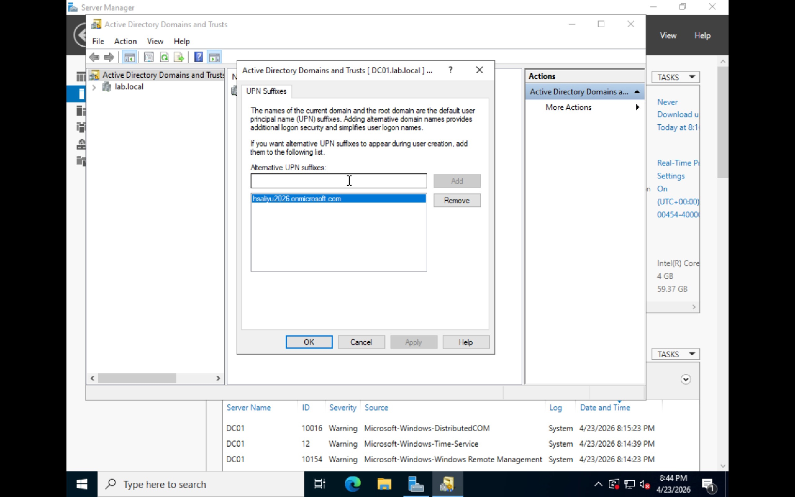
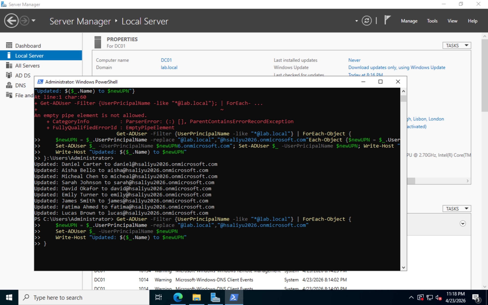
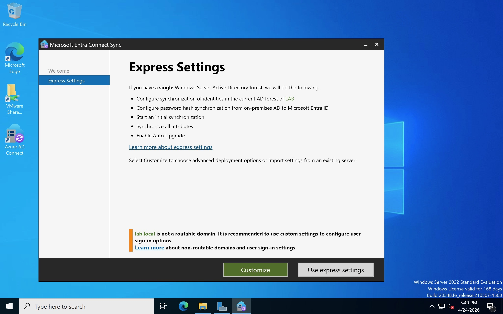
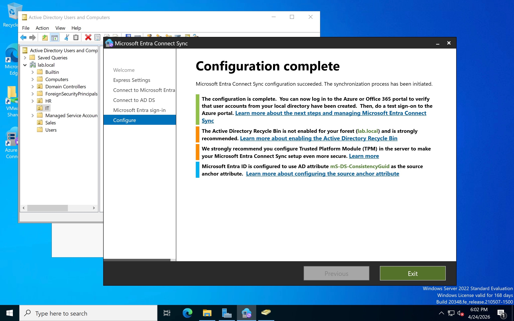
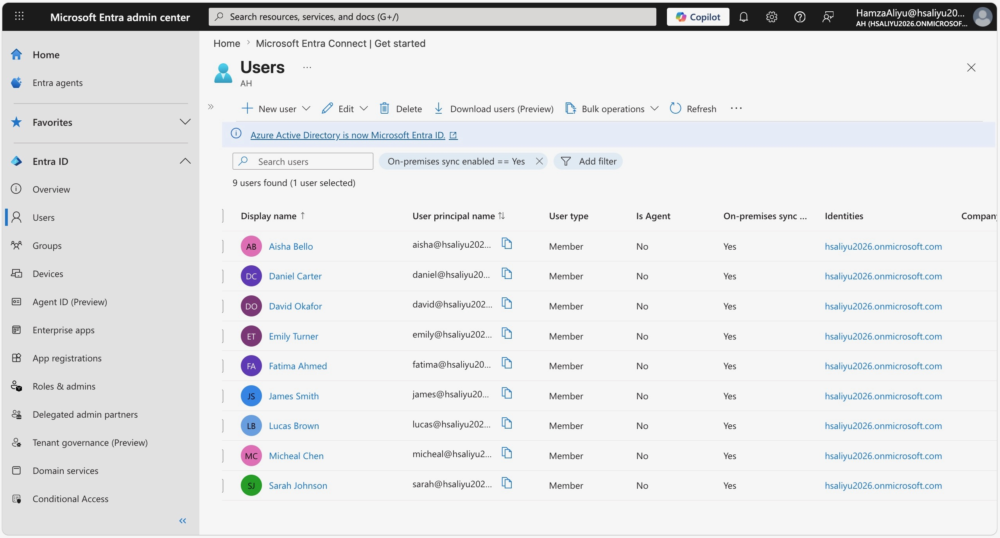
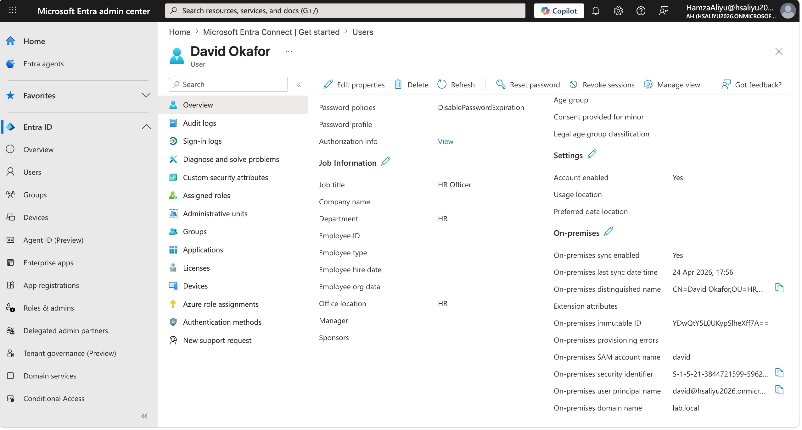
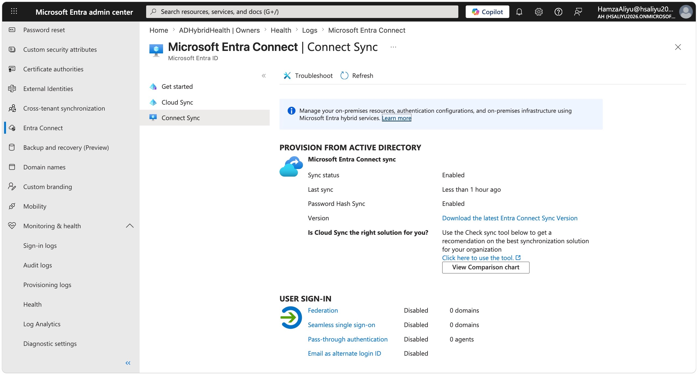

# Lab 06 — Hybrid Identity with Microsoft Entra Connect

## Overview

This lab demonstrates the configuration of hybrid identity by connecting an on-premises Active Directory environment to Microsoft Entra ID using Microsoft Entra Connect. Hybrid identity is the foundation of the vast majority of enterprise environments in the UK — organisations rarely operate purely on-premises or purely in the cloud. Instead they run a hybrid model where on-premises Active Directory remains the authoritative identity source while Microsoft Entra ID extends those identities into the cloud.

Microsoft Entra Connect acts as the bridge between these two worlds. It synchronises user accounts, groups, and attributes from on-premises AD into Entra ID, enabling users to authenticate to both on-premises and cloud resources using the same credentials. 

This lab builds on the existing on-premises environment consisting of:
- Windows Server 2022 Domain Controller with Active Directory Domain Services
- Domain: `lab.local`
- Several AD users organised into OUs with Group Policy applied
- Windows 11 client joined to the domain

---

## Objectives

- Add a routable UPN suffix to on-premises Active Directory to enable cloud synchronisation
- Update all on-premises AD user UPNs from the non-routable `@lab.local` suffix to the cloud-compatible `@hsaliyu2026.onmicrosoft.com` suffix using PowerShell
- Download and install Microsoft Entra Connect using the current portal path
- Configure Entra Connect using Express Settings to synchronise users via Password Hash Synchronisation
- Verify successful synchronisation of on-premises users into Microsoft Entra ID
- Confirm hybrid identity status via the Entra Connect sync health dashboard

---

## Tools & Services Used

- Windows Server 2022 (Domain Controller — VMware Fusion on macOS)
- Active Directory Domain Services (AD DS)
- Active Directory Domains and Trusts
- PowerShell (Active Directory module)
- Microsoft Entra Connect (Connect Sync)
- Microsoft Entra admin centre (entra.microsoft.com)

---

## Prerequisites

- Windows Server 2022 Domain Controller deployed and configured with AD DS
- Active Directory users created with `@lab.local` UPN suffix
- Windows 11 client joined to the `lab.local` domain
- Domain Administrator credentials available
- Microsoft Entra ID P2 trial active
- Global Administrator credentials for `hsaliyu2026.onmicrosoft.com`
- Internet access from the Domain Controller VM

---

## Architecture Overview

```
On-Premises (VMware Lab)              Cloud (Microsoft Entra ID)
─────────────────────────             ──────────────────────────
Windows Server 2022 DC                Entra ID Tenant
  │                                   hsaliyu2026.onmicrosoft.com
  │  lab.local domain                   │
  │  AD Users (9 users)                 │  Synced users
  │  OUs & Group Policies               │  (Windows Server AD source)
  │                                     │
  └──── Microsoft Entra Connect ────────┘
         (Password Hash Sync)
```

---

## Step-by-Step Walkthrough

### Step 1 — Add UPN Suffix in Active Directory Domains and Trusts

The first step was to add a routable UPN suffix to the on-premises AD. By default all users in the `lab.local` domain have UPNs in the format `user@lab.local`. The `.local` suffix is non-routable — it does not exist on the internet — and Microsoft Entra ID cannot verify or accept it during synchronisation. Adding the `hsaliyu2026.onmicrosoft.com` suffix as an alternative UPN allows on-premises users to be assigned a cloud-compatible identity before syncing.

1. Opened **Server Manager → Tools → Active Directory Domains and Trusts**
2. Right-clicked **Active Directory Domains and Trusts** at the top of the left panel
3. Clicked **Properties**
4. In the **UPN Suffixes** tab entered: `hsaliyu2026.onmicrosoft.com`
5. Clicked **Add → OK**



---

### Step 2 — Update AD User UPNs via PowerShell

With the new UPN suffix registered, all on-premises AD users needed their UPN updated from `@lab.local` to `@hsaliyu2026.onmicrosoft.com`. This was performed using PowerShell on the Domain Controller.

The following piped command was run to update all users with a `@lab.local` UPN suffix:

```powershell
Get-ADUser -Filter {UserPrincipalName -like "*@lab.local"} | ForEach-Object {
    $newUPN = $_.UserPrincipalName -replace "@lab.local","@hsaliyu2026.onmicrosoft.com"
    Set-ADUser $_ -UserPrincipalName $newUPN
    Write-Host "Updated: $($_.Name) to $newUPN"
}
```

The command successfully updated all 9 on-premises AD users:

- Daniel Carter → daniel@hsaliyu2026.onmicrosoft.com
- Aisha Bello → aisha@hsaliyu2026.onmicrosoft.com
- Micheal Chen → micheal@hsaliyu2026.onmicrosoft.com
- Sarah Johnson → sarah@hsaliyu2026.onmicrosoft.com
- David Okafor → david@hsaliyu2026.onmicrosoft.com
- Emily Turner → emily@hsaliyu2026.onmicrosoft.com
- James Smith → james@hsaliyu2026.onmicrosoft.com
- Fatima Ahmed → fatima@hsaliyu2026.onmicrosoft.com
- Lucas Brown → lucas@hsaliyu2026.onmicrosoft.com

All users were confirmed as updated to the `@hsaliyu2026.onmicrosoft.com` suffix and ready for synchronisation.



---

### Step 3 — Download Microsoft Entra Connect

The Microsoft Entra Connect download link previously available at microsoft.com/download is no longer active. The current download path is through the Entra admin centre:

**entra.microsoft.com → Identity → Entra Connect → Manage → Download Connect Sync agent**

The installer (`AzureADConnect.msi`) was downloaded and run on the Domain Controller.



---

### Step 4 — Configure Entra Connect Using Express Settings

Express Settings was selected as the installation method. This configures the most common hybrid identity setup automatically:

- **Password Hash Synchronisation** — on-premises password hashes are synced to Entra ID, enabling cloud authentication
- **Seamless Single Sign-On** — users signed into the domain are automatically authenticated to cloud resources
- **Full synchronisation** — all users and groups in AD are synced to Entra ID

**Entra ID sign-in (cloud):**
- Signed in with Global Administrator: `HamzaAliyu@hsaliyu2026.onmicrosoft.com`

**AD DS sign-in (on-premises):**
- Signed in with Domain Administrator: `LAB\Administrator`

**UPN suffix warning:**
During the sign-in configuration step a warning was displayed indicating that the `hsaliyu2026.onmicrosoft.com` UPN suffix could not be verified as a custom domain. This is expected behaviour — `onmicrosoft.com` domains are managed by Microsoft and do not require manual DNS verification. The option **"Continue without matching all UPN suffixes to verified domains"** was ticked and the wizard proceeded.

**Final configuration:**
- Ticked **Start the synchronisation process when configuration completes**
- Clicked **Install**
- Installation and first synchronisation completed successfully



---

### Step 5 — Verify User Synchronisation in Entra ID

After the first synchronisation cycle completed, navigated to **entra.microsoft.com → Identity → Users → All users** to verify that on-premises AD users had synced successfully into Entra ID.

All on-premises AD users appeared in the Entra ID user list with:
- **UPN:** `username@hsaliyu2026.onmicrosoft.com`
- **On-premises sync enabled:** Yes

This confirmed that hybrid identity synchronisation was working correctly and on-premises identities were now visible and manageable from the cloud.



Clicked on an individual synced user to review their full profile, confirming the Windows Server AD source and verifying that attributes such as display name, UPN, and account status had synced correctly.



---

### Step 6 — Verify Sync Health in Entra Connect Dashboard

Navigated to:
**entra.microsoft.com → Identity → Hybrid management → Microsoft Entra Connect → Connect Sync**

The dashboard confirmed:
- Sync status: **Enabled**
- Last sync time: confirmed as recent
- No sync errors reported

This view provides ongoing visibility into the health of the hybrid identity pipeline and is where an IAM engineer would monitor for sync failures, attribute errors, or connectivity issues between the on-premises environment and Entra ID.

Also visible on the same page was **Microsoft Entra Connect Health** under the **Health and analytics** section. Connect Health provides deeper monitoring of on-premises identity infrastructure and synchronisation services from the cloud — including sync error reporting, performance metrics, and alerts for connectivity issues between the Domain Controller and Entra ID. In a production enterprise environment Connect Health would be configured as a continuous monitoring tool, giving the security and identity team visibility into the health of the hybrid identity pipeline without needing to log into the on-premises server directly.



---

## Key Security Concepts Demonstrated

- **Hybrid Identity Architecture** — The vast majority of UK enterprise environments run hybrid identity where on-premises AD is the authoritative source and Entra ID extends those identities to the cloud. Understanding this architecture is fundamental to IAM and cloud security engineering roles

- **UPN Suffix Requirements** — Microsoft Entra ID requires routable UPN suffixes for synchronisation. Non-routable suffixes like `.local` must be replaced with a verified or onmicrosoft.com domain before sync can succeed. This is a common real-world challenge when organisations begin their cloud identity journey

- **Password Hash Synchronisation** — PHS copies a hash of the on-premises password hash to Entra ID, enabling cloud authentication without requiring a persistent connection to the on-premises environment. It also enables leaked credential detection through Entra ID Protection

- **Identity Source of Truth** — In a hybrid environment, on-premises AD remains the source of truth for synced users. Changes to synced user attributes must be made in AD — not directly in Entra ID — and will be overwritten on the next sync cycle if changed in the cloud

- **Sync Health Monitoring** — The Entra Connect dashboard provides visibility into synchronisation health, last sync time, and errors. Monitoring this is an operational responsibility for any team managing hybrid identity

- **PowerShell for Bulk Identity Management** — Bulk UPN updates across multiple users are best handled through PowerShell rather than manually through the GUI, reflecting real-world enterprise identity management practice

---

## Challenges & How I Solved Them

**Challenge 1 — PowerShell parser error on initial UPN update attempt**

When first attempting to run the piped ForEach-Object command to update user UPNs, a parser error was returned:

`Unexpected token 'Set-ADUser' in expression or statement`

The error was caused by line break characters being introduced when copying the command from documentation, causing PowerShell to interpret the piped sections as separate statements.

The issue was resolved by running the command directly in the PowerShell window as a proper multi-line block, allowing PowerShell to correctly interpret the pipe and ForEach-Object structure:

```powershell
Get-ADUser -Filter {UserPrincipalName -like "*@lab.local"} | ForEach-Object {
    $newUPN = $_.UserPrincipalName -replace "@lab.local","@hsaliyu2026.onmicrosoft.com"
    Set-ADUser $_ -UserPrincipalName $newUPN
    Write-Host "Updated: $($_.Name) to $newUPN"
}
```

All 9 users were successfully updated once the command was entered correctly.

---

**Challenge 2 — Microsoft Entra Connect download link no longer active**

The previously documented download URL for Microsoft Entra Connect at [microsoft.com/download](https://www.microsoft.com/en-us/download/details.aspx?id=47594) returned a decommissioned message. Microsoft has moved the download into the Entra admin centre as part of consolidating hybrid identity management into the portal.

The current download path is:

**entra.microsoft.com → Identity → Entra Connect → Manage → Connect Sync → Download Connect Sync agent**

This reflects Microsoft's ongoing consolidation of hybrid identity tooling into the Entra admin centre rather than standalone download pages.

---

**Challenge 3 — UPN suffix not verified warning during Express Settings**

During the Entra Connect configuration wizard, a warning was displayed stating that the `hsaliyu2026.onmicrosoft.com` UPN suffix could not be verified as a custom domain. This appeared concerning initially but was confirmed as expected behaviour.

The `onmicrosoft.com` domain is a Microsoft-managed domain and does not require DNS verification by the tenant administrator. The warning exists because the wizard is designed for scenarios where organisations use a custom domain (e.g. `company.com`) which must be verified in Entra ID. For lab environments using the default onmicrosoft.com domain, the option **"Continue without matching all UPN suffixes to verified domains"** is the correct choice and does not affect synchronisation functionality.

---

## What I Learned

- Hybrid identity is the standard architecture in UK enterprise environments — understanding how on-premises AD and Entra ID work together is a fundamental skill for IAM and cloud security roles
- Non-routable domain suffixes like `.local` cannot be synchronised to Entra ID — adding a routable alternative UPN suffix and updating users before sync is a required preparation step
- The Microsoft Entra Connect download has moved from standalone download pages into the Entra admin centre, reflecting Microsoft's portal consolidation strategy
- Password Hash Synchronisation is the recommended sync method for most organisations as it provides cloud authentication resilience and enables Entra ID Protection's leaked credential detection
- In hybrid environments, on-premises AD remains the source of truth — changes to synced user attributes must be made on-premises and will flow to the cloud on the next sync cycle
- PowerShell foreach loops are more reliable than piped ForEach-Object commands when copying scripts from external documentation due to line break sensitivity
- The UPN suffix verification warning during Express Settings is expected when using onmicrosoft.com domains and does not indicate a configuration error

---

## What's Next — Building on This Lab

With hybrid identity now established the following labs become possible:

- **Lab 07 — Microsoft Defender for Identity:** Deploy a sensor on the Domain Controller to detect on-premises AD attacks and feed alerts into Microsoft Sentinel
- **Lab 08 — Attack Simulation:** Simulate real AD attacks (Kerberoasting, Pass-the-Hash, lateral movement) from the Windows 11 client and detect them in Sentinel
- **Lab 09 — Conditional Access for Hybrid Users:** Apply Conditional Access policies to the synced on-premises users, enforcing MFA and device compliance for cloud resource access

---

## Operational Knowledge — Managing Hybrid Identity Day-to-Day

After completing the initial Entra Connect setup, additional testing was conducted to understand how the sync engine handles ongoing identity management. This section documents those findings as they reflect real-world operational knowledge relevant to any IAM or cloud security engineering role.

---

### UPN Suffix Selection When Creating New Users

After the initial bulk UPN update, a question arose about what happens when new AD users are created — specifically whether selecting `@lab.local` vs `@hsaliyu2026.onmicrosoft.com` as the UPN suffix during user creation makes a difference.

**Two scenarios were tested:**

**Scenario 1 — User created with @lab.local UPN:**
Entra Connect syncs the user but automatically substitutes the onmicrosoft.com domain as a fallback. The user appears in Entra ID but with a different UPN than what was set in AD.

**Scenario 2 — User created with @hsaliyu2026.onmicrosoft.com UPN:**
Entra Connect syncs the user cleanly with no warnings. The UPN in AD matches exactly what Entra ID receives — this is the correct approach for all new user creation going forward.

**Conclusion:** Since `hsaliyu2026.onmicrosoft.com` was added as an alternative UPN suffix in Active Directory Domains and Trusts during Step 1, it now appears in the UPN suffix dropdown when creating new users in Active Directory Users and Computers. All new users should be created with this suffix selected to ensure clean synchronisation.

**Tested and confirmed:** A user created with `@lab.local` was updated to `@hsaliyu2026.onmicrosoft.com` directly in AD and synced successfully to Entra ID on the next cycle.

---

### Managing the Entra Connect Sync Scheduler

The Entra Connect sync scheduler runs automatically every **30 minutes** by default. This is managed entirely through PowerShell on the Domain Controller using the ADSync module installed with Entra Connect. There is no GUI for scheduler management.

**View current scheduler configuration:**

```powershell
Get-ADSyncScheduler
```

Key fields returned:

| Field | Description |
|---|---|
| `CurrentlyEffectiveSyncCycleInterval` | How often automatic sync runs |
| `NextSyncCycleStartTimeInUTC` | When the next scheduled sync will run |
| `SyncCycleEnabled` | Whether automatic sync is active |
| `StagingModeEnabled` | If True, sync is paused in staging mode |

**Change the sync interval:**

```powershell
# Change to 60 minutes
Set-ADSyncScheduler -CustomizedSyncCycleInterval "00:60:00"

# Revert to default 30 minutes
Set-ADSyncScheduler -CustomizedSyncCycleInterval "00:30:00"
```

> Microsoft enforces a minimum sync interval of 30 minutes. Values below this are rejected and the scheduler reverts to 30 minutes automatically.

**Pause and resume automatic sync:**

```powershell
# Pause — useful when making bulk changes
Set-ADSyncScheduler -SyncCycleEnabled $false

# Resume
Set-ADSyncScheduler -SyncCycleEnabled $true
```

---

### Triggering a Manual Sync

Rather than waiting for the 30-minute automatic cycle, a manual sync can be triggered immediately. Two sync types are available:

```powershell
# Delta sync — only syncs changes since the last cycle (recommended for day-to-day use)
Start-ADSyncSyncCycle -PolicyType Delta

# Initial sync — full resync of all objects (use for troubleshooting or major changes)
Start-ADSyncSyncCycle -PolicyType Initial
```

| Sync Type | What it does | When to use |
|---|---|---|
| **Delta** | Syncs only objects changed since last run | After adding or modifying a user |
| **Initial** | Full resync of all objects from scratch | After major AD changes or troubleshooting sync errors |

**Tested and confirmed:** After creating a new user in AD with the correct `@hsaliyu2026.onmicrosoft.com` UPN suffix, running `Start-ADSyncSyncCycle -PolicyType Delta` caused the user to appear in Entra ID within approximately 2 minutes — significantly faster than waiting for the automatic 30-minute cycle.

This operational knowledge is directly applicable to enterprise IAM engineering roles where helpdesk teams or provisioning workflows require new users to be available in cloud systems immediately after creation rather than waiting for the next scheduled sync.

---

## References

- [Microsoft Learn — What is Microsoft Entra Connect?](https://learn.microsoft.com/en-us/entra/identity/hybrid/connect/whatis-azure-ad-connect)
- [Microsoft Learn — Express settings for Entra Connect](https://learn.microsoft.com/en-us/entra/identity/hybrid/connect/how-to-connect-install-express)
- [Microsoft Learn — Password Hash Synchronisation](https://learn.microsoft.com/en-us/entra/identity/hybrid/connect/whatis-phs)
- [Microsoft Learn — Add UPN suffixes to AD](https://learn.microsoft.com/en-us/entra/identity/hybrid/connect/how-to-connect-install-prerequisites#add-upn-suffix)
- [Microsoft Learn — Entra Connect sync health monitoring](https://learn.microsoft.com/en-us/entra/identity/hybrid/connect/how-to-connect-health-sync)

