# Lab 07 — Microsoft Defender for Identity: Hybrid Threat Detection

## Overview

This lab demonstrates the deployment and configuration of Microsoft Defender for Identity (MDI) to enable on-premises Active Directory threat detection as part of a hybrid security monitoring architecture. MDI works by installing a lightweight sensor directly on the Domain Controller that monitors all Active Directory authentication traffic, privilege changes, and suspicious activity in real time — feeding alerts into the Microsoft Defender portal and Microsoft Sentinel.

This lab completes the hybrid detection pipeline established in Lab 06, where Microsoft Entra Connect was configured to synchronise on-premises AD users into Entra ID. With MDI now deployed, on-premises identity attacks that would previously have been invisible to cloud security tooling are now detected, investigated, and correlated with cloud identity events in a single unified platform.

A significant portion of this lab involved troubleshooting the MDI licensing and auditing configuration — both of which reflect real-world challenges that security engineers encounter when deploying MDI in enterprise environments. These are documented in full as they demonstrate practical problem-solving ability beyond the standard deployment guide.

---

## Objectives

- Activate Microsoft Defender for Identity using Microsoft 365 E5 licensing
- Deploy the MDI classic sensor on the on-premises Domain Controller
- Configure the directory services account for MDI to query Active Directory
- Configure all required audit policies and GPOs using the DefenderForIdentity PowerShell module
- Resolve the Directory Services Object Auditing health warning
- Validate data ingestion using Advanced Hunting queries in the Microsoft Defender portal
- Simulate on-premises identity attacks and confirm detection capability
- Understand the unified Defender + Sentinel architecture and where MDI data flows

---

## Tools & Services Used

- Microsoft Defender for Identity (MDI)
- Microsoft 365 E5 (required licence)
- Microsoft Defender portal (defender.microsoft.com)
- DefenderForIdentity PowerShell module
- Group Policy Management Console (GPMC)
- Windows Server 2022 Domain Controller (VMware lab)
- Advanced Hunting (KQL) — Microsoft Defender portal
- Microsoft Sentinel (unified architecture)

---

## Prerequisites

- Windows Server 2022 Domain Controller deployed with AD DS (from Lab 06)
- Microsoft Entra Connect configured and syncing (from Lab 06)
- Microsoft 365 E5 licence activated and assigned
- Global Administrator credentials
- Domain Administrator credentials
- Internet access from the Domain Controller VM

---

## Architecture — Hybrid Detection Pipeline

```
Windows Server 2022 DC (lab.local)
          │
          │  MDI Sensor — monitors ALL AD traffic in real time
          ▼
Microsoft Defender for Identity
          │
          │  IdentityDirectoryEvents, IdentityLogonEvents
          ▼
Microsoft Defender Portal (Unified SIEM + XDR)
          │
          │  Unified architecture — automatic ingestion
          ▼
Microsoft Sentinel ──► Advanced Hunting + Incidents
```

---

## Step-by-Step Walkthrough

### Step 1 — Activate Microsoft Defender for Identity

MDI requires Microsoft 365 E5, Microsoft 365 E5 Security, or EMS E5 licensing. Microsoft 365 E5 trial was successfully activated through the Microsoft 365 admin centre.

After activation the licence was assigned to the administrator account via:
**admin.microsoft.com → Users → Active users → Hamza Aliyu → Licences and apps → Microsoft 365 E5 → Save**

With the licence assigned, **Identities** appeared in the Microsoft Defender portal left menu, confirming MDI was provisioned. The Coverage & Maturity page showed 1/4 tasks completed with **"Enable on-premises discovery using Microsoft Defender for Identity"** highlighted as the next required action.

> **Licensing note:** MDI is not included in Office 365 E5 or Microsoft 365 E3. Only Microsoft 365 E5, Microsoft 365 E5 Security, or EMS E5 include MDI. 

---

### Step 2 — Download and Install the MDI Sensor

Navigated to:
**defender.microsoft.com → Settings → Identities → On-premises → Sensors**

A popup offered two installation options — **Activate servers** (new method requiring Defender for Endpoint onboarding) and **Continue with the classic sensor**. The classic sensor was selected as the most reliable option for Windows Server 2022 in a lab environment.

The access key was copied from the Sensors page before downloading the installer.

**File transfer method:** VMware shared folders were configured between the Mac host and the Domain Controller VM, allowing the installer to be accessed directly at `\\vmware-host\Shared Folders\Downloads\` on the DC without requiring upload to cloud storage.

The installer was run as Administrator on the Domain Controller. During installation:
- Deployment type: **Sensor** (auto-detected)
- Access key: pasted from the Defender portal
- Installation completed successfully within 3–5 minutes

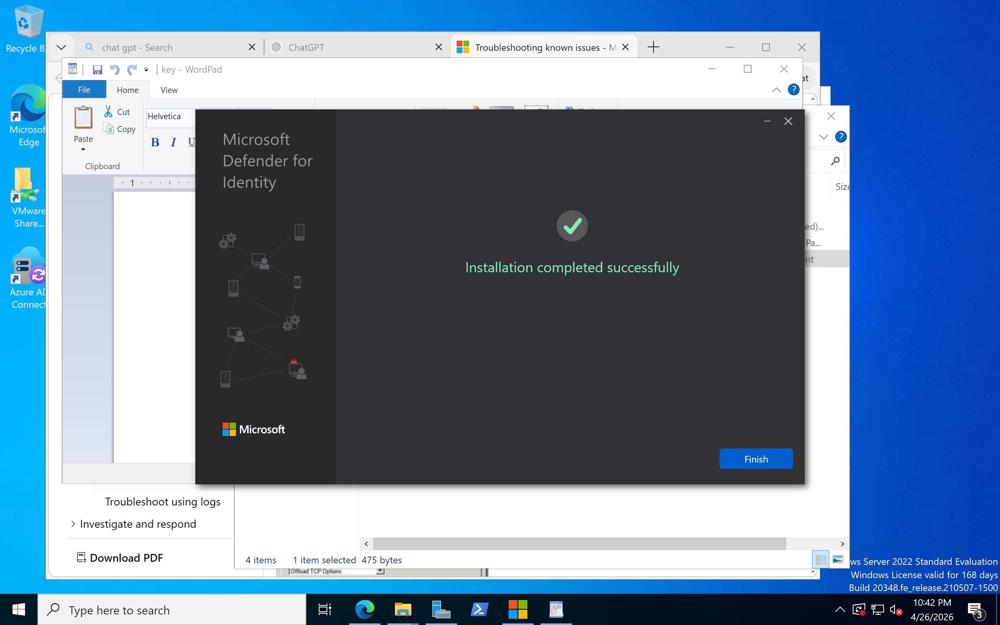

---

### Step 3 — Verify Sensor Status

After installation, returned to the Defender portal to confirm the sensor registered successfully.

Navigated to **Settings → Identities → Sensors:**
- Domain Controller listed as a sensor
- Sensor status: **Running**
- Domain: **lab.local**

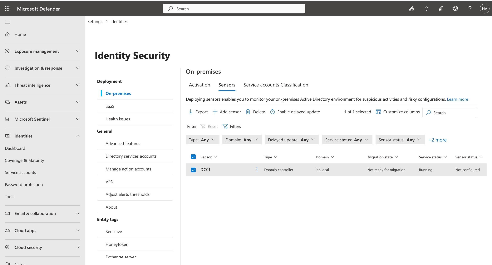

Verified on the Domain Controller via Services:
- Service name: **Azure Advanced Threat Protection Sensor**
- Status: **Running**
- Start type: **Automatic**

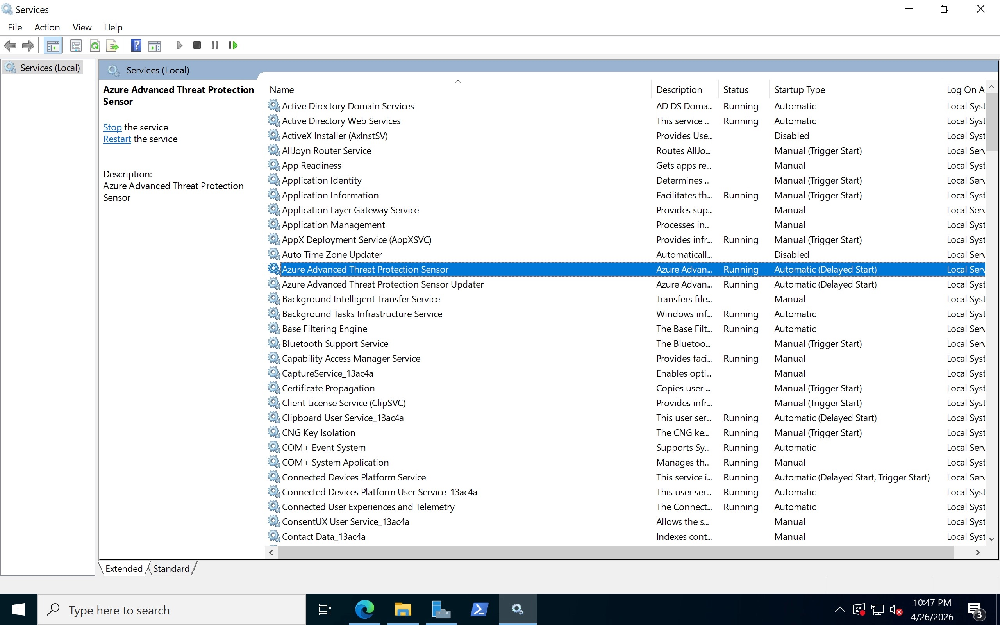

---

### Step 4 — Configure Directory Services Account

MDI requires a service account to query Active Directory and understand normal behaviour patterns. Without this account the sensor runs but cannot interpret AD activity or generate meaningful detections.

Navigated to **Settings → Identities → Directory services accounts → Add credentials:**
- Account type: Active Directory user account
- Username: Administrator
- Domain: lab.local
- Password: domain administrator password

Credentials saved successfully.

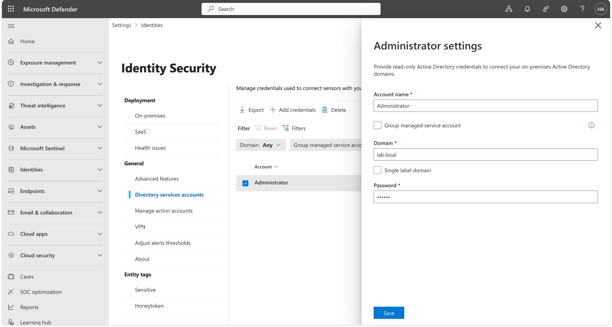

---

### Step 5 — Resolve Audit Configuration Health Warning

The Health Issues page showed:

> **"Directory Services Object Auditing is not configured as required"**

With recommendations to configure Directory Services Object Auditing and Windows event auditing according to Microsoft guidance.

**Resolution — DefenderForIdentity PowerShell Module**

The DefenderForIdentity PowerShell module was installed and used to diagnose and fix all audit configuration issues:

```powershell
# Install the module
Install-Module DefenderForIdentity -Force
Import-Module DefenderForIdentity

# Generate diagnostic report
New-MDIConfigurationReport -Path "C:\MDIReport" -Mode Domain -OpenHtmlReport
```

The initial report showed **11 failures** across audit policies, GPO configurations, and domain object settings.

```powershell
# Apply all required configurations
Set-MDIConfiguration -Mode Domain -Configuration All

# Force GPO update
gpupdate /force
```

After running Set-MDIConfiguration, individual configurations were tested:

```powershell
$configs = @("AdfsAuditing","AdRecycleBin","AdvancedAuditPolicyDCs",
             "DomainObjectAuditing","NTLMAuditing","ProcessorPerformance",
             "RemoteSAM","KdsAuditing","DeletedObjectsContainerPermission",
             "EntraConnectAuditing")

foreach ($config in $configs) {
    $result = Test-MDIConfiguration -Mode Domain -Configuration $config 2>$null
    $status = if ($result) { "✅ PASS" } else { "❌ FAIL" }
    Write-Host "$status - $config"
}
```


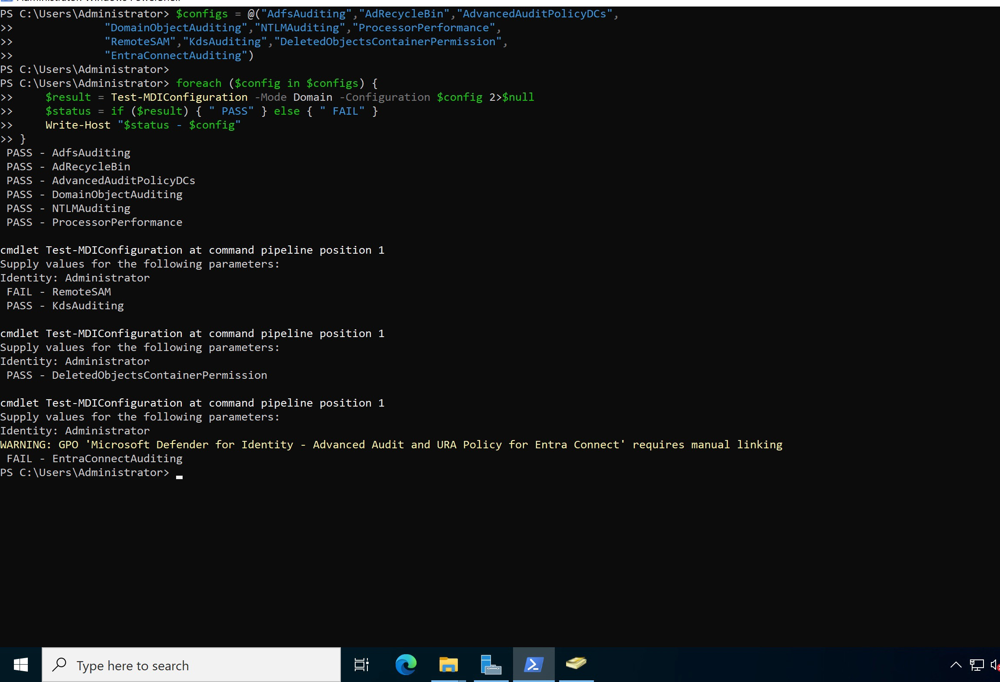

**Results after remediation:**

| Configuration | Status |
|---|---|
| AdfsAuditing | ✅ Pass |
| AdRecycleBin | ✅ Pass |
| AdvancedAuditPolicyDCs | ✅ Pass |
| DomainObjectAuditing | ✅ Pass |
| NTLMAuditing | ✅ Pass |
| ProcessorPerformance | ✅ Pass |
| KdsAuditing | ✅ Pass |
| DeletedObjectsContainerPermission | ✅ Pass |
| RemoteSAM | ⚠️ Requires manual GPO linking |
| EntraConnectAuditing | ⚠️ Separate server required |

**GPO linking for RemoteSAM:**

The MDI GPOs were created but not all were linked to the Domain Controllers OU. Verified linked GPOs:

```powershell
Get-GPInheritance -Target "OU=Domain Controllers,DC=lab,DC=local" |
Select-Object -ExpandProperty GpoLinks |
Select-Object DisplayName, Enabled, Enforced |
Format-Table -AutoSize
```

Four MDI GPOs confirmed as linked and enforced:
- Microsoft Defender for Identity — Advanced Audit Policy for DCs ✅
- Microsoft Defender for Identity — NTLM Auditing for DCs ✅
- Microsoft Defender for Identity — Processor Performance ✅
- Microsoft Defender for Identity — Remote SAM Access ✅

The CA-related GPOs (AdvancedAuditPolicyCAs, CAAuditing) were not linked as there is no Certificate Authority server in this lab environment — this is expected.

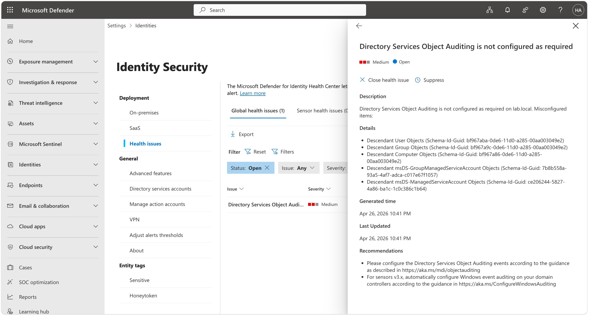

---

### Step 6 — Attack Simulations

With auditing configured and the sensor running, attack simulations were performed from the **Windows 11 domain-joined client VM** and the **Domain Controller** to generate real MDI detections.

**Simulation 1 — LDAP Reconnaissance**

Performed from the Windows 11 client to simulate an attacker enumerating AD users after gaining access to a domain-joined machine:

```powershell
$domain = New-Object DirectoryServices.DirectoryEntry
$searcher = New-Object DirectoryServices.DirectorySearcher($domain)
$searcher.Filter = "(objectClass=user)"
$searcher.PropertiesToLoad.Add("samaccountname") | Out-Null
$searcher.PropertiesToLoad.Add("memberof") | Out-Null
$searcher.SizeLimit = 1000
$results = $searcher.FindAll()
Write-Host "Found $($results.Count) user objects:" -ForegroundColor Yellow
foreach ($result in $results) {
    Write-Host $result.Properties["samaccountname"] -ForegroundColor Cyan
}
```

Run 3 times in succession to simulate the pattern-based detection MDI uses.

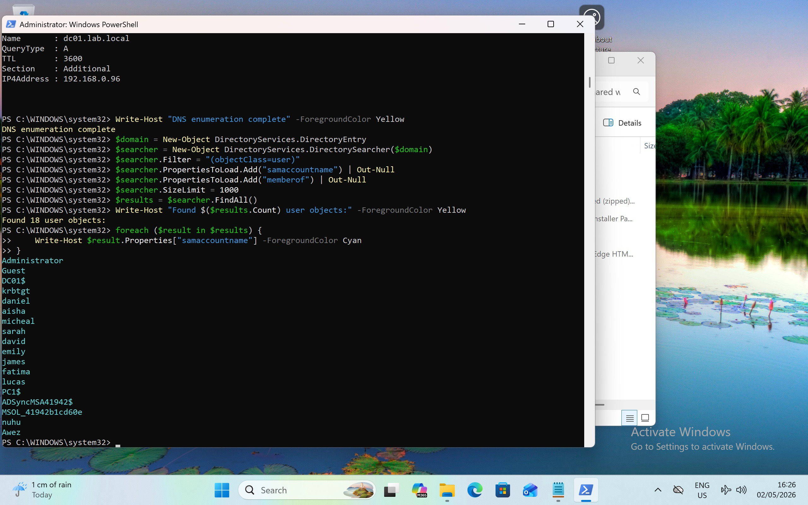

**Simulation 2 — Privileged Group Enumeration**

Simulated attacker identifying high-value targets by enumerating privileged group membership:

```powershell
$groups = @("Domain Admins","Enterprise Admins","Schema Admins",
            "Administrators","Group Policy Creator Owners")
foreach ($group in $groups) {
    Write-Host "`n=== $group ===" -ForegroundColor Red
    $members = Get-ADGroupMember -Identity $group -Recursive
    foreach ($member in $members) {
        Write-Host "  $($member.SamAccountName) [$($member.objectClass)]"
    }
}
```

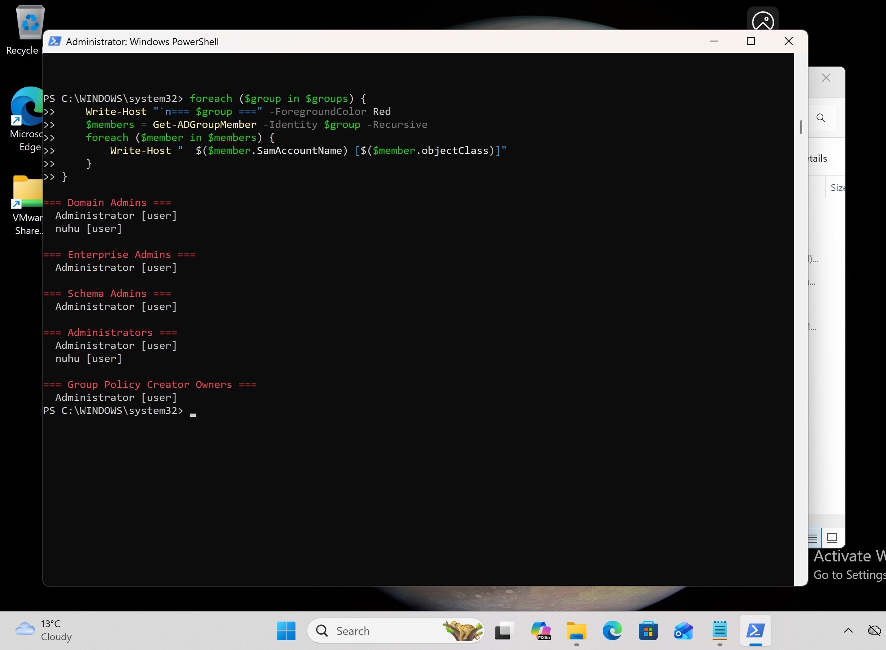

**Simulation 3 — Privilege Escalation**

Performed from the Domain Controller to simulate an insider threat or compromised admin account adding an unauthorised user to Domain Admins:

```powershell
Add-ADGroupMember -Identity "Domain Admins" -Members "james"
Write-Host "James added to Domain Admins" -ForegroundColor Red
Start-Sleep -Seconds 120
Remove-ADGroupMember -Identity "Domain Admins" -Members "james" -Confirm:$false
Write-Host "James removed from Domain Admins" -ForegroundColor Green
```

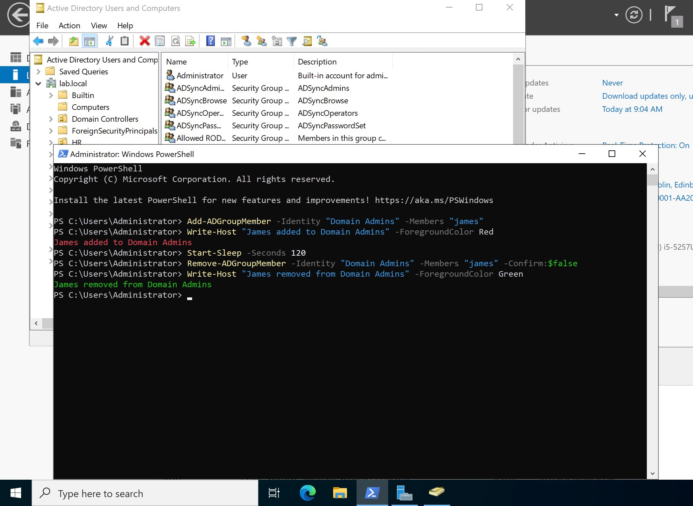

**Note:** This command requires the Active Directory PowerShell module (RSAT: Active Directory Domain Services) to be installed on the Windows 11 client. See Challenge 6 below for the resolution applied.

---

### Step 7 — Validate Data in Advanced Hunting

Data was validated in the Microsoft Defender portal via Advanced Hunting. Note that due to the unified Defender + Sentinel architecture, MDI data flows into the Defender portal's Advanced Hunting tables rather than directly into Sentinel's Log Analytics workspace. This is expected behaviour in the unified SIEM + XDR platform.

**Query 1 — Directory Events by Action Type**

```kql
IdentityDirectoryEvents
| where TimeGenerated > ago(24h)
| summarize count() by ActionType
| order by count_ desc
```

Results confirmed MDI was capturing a range of directory events including group membership changes, user modifications, and account operations generated by the simulations.

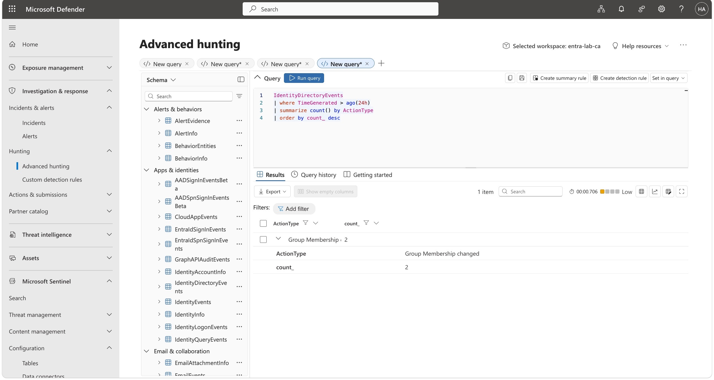

**Query 2 — Logon Events**

```kql
IdentityLogonEvents
| where TimeGenerated > ago(7d)
| summarize count() by ActionType, AccountDisplayName
| order by count_ desc
| take 20
```

Results confirmed authentication events were being captured for domain users across the lab environment. The 7-day time range was used as logon events from the simulations occurred earlier in the week.

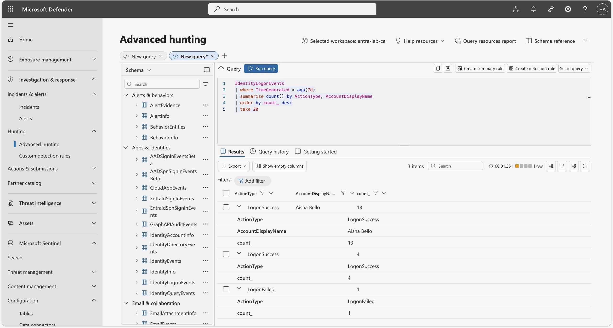

**Query 3 — Simulation Activity**

```kql
IdentityDirectoryEvents
| where TimeGenerated > ago(7d)
| where ActionType in ("Group Membership changed",
                       "User Account created",
                       "Account Password changed")
| project TimeGenerated, ActionType,
          TargetAccountDisplayName, ReportId
| order by TimeGenerated desc
```

Results confirmed the privilege escalation simulation (James added and removed from Domain Admins) was captured as a Group Membership changed event.

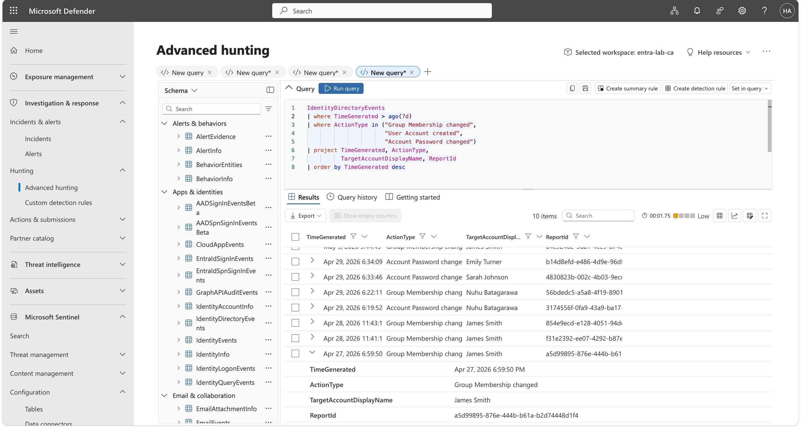

---

## Key Security Concepts Demonstrated

- **Hybrid Threat Detection** — MDI extends cloud security visibility into the on-premises AD environment, closing the detection gap that exists when cloud tools cannot see on-premises authentication and privilege activity

- **Sensor-Based Monitoring** — The MDI sensor operates at the network packet level on the Domain Controller, capturing all Kerberos, NTLM, LDAP, and AD replication traffic without requiring agents on every endpoint

- **Audit Policy Requirements** — MDI depends on Windows Security Event auditing being correctly configured. Without the right audit policies enabled the sensor runs silently without generating detections — a critical operational consideration for enterprise deployments

- **Unified SIEM + XDR Architecture** — In the unified Defender + Sentinel architecture, MDI data flows into Defender Advanced Hunting tables (IdentityDirectoryEvents, IdentityLogonEvents) rather than classic Sentinel Log Analytics tables. Incident management is handled in the Defender portal rather than Sentinel when the unified platform is enabled

- **LDAP Reconnaissance Detection** — One of the most common attacker first steps after gaining domain access is LDAP enumeration to identify users, groups, and high-value targets. MDI detects this through pattern analysis rather than single-event alerting

- **Privilege Escalation Detection** — Unauthorised additions to privileged groups like Domain Admins are a critical indicator of compromise. MDI captures these as IdentityDirectoryEvents with ActionType "Group Membership changed"

- **DefenderForIdentity PowerShell Module** — The MDI PowerShell module provides automated audit configuration, diagnostic reporting, and GPO management — significantly reducing the complexity of MDI deployment compared to manual configuration

---

## Challenges & How I Solved Them

**Challenge 1 — MDI licensing not available on existing tenant**

The existing lab tenant had Office 365 E5 and Microsoft Entra ID P2 trials available, neither of which includes MDI. Microsoft 365 E5 was the required licence. The Microsoft 365 E5 trial was activated through the Microsoft 365 admin centre and assigned to the administrator account, after which MDI became available in the Defender portal.

**Key learning:** MDI requires Microsoft 365 E5, Microsoft 365 E5 Security, or EMS E5. Office 365 E5 is a productivity licence and does not include security products like MDI. 

---

**Challenge 2 — Classic sensor vs new activation method**

When navigating to the Sensors page a popup offered two options: the new activation method (requiring Defender for Endpoint onboarding) and the classic sensor. The new method showed 0 eligible servers as the DC had not been onboarded to Defender for Endpoint. The classic sensor was selected as the appropriate method for this environment.

---

**Challenge 3 — Directory Services Object Auditing health warning**

After sensor installation the Health Issues page showed a Directory Services Object Auditing warning. Initial attempts to resolve this using manual auditpol commands did not clear the warning.

The resolution was to use the **DefenderForIdentity PowerShell module**, which provides automated diagnosis and remediation:

```powershell
Install-Module DefenderForIdentity -Force
Set-MDIConfiguration -Mode Domain -Configuration All
gpupdate /force
```

This reduced failures from 11 to 2. 

---

**Challenge 4 — Identity parameter format for MDI PowerShell module**

The MDI PowerShell module prompted for an Identity parameter during report generation and testing. Various formats were attempted including `LAB\Administrator` and `Administrator@hsaliyu2026.onmicrosoft.com`. The correct format was `Administrator` (SAM account name only). The `LAB\Administrator` format produced a "Cannot find the specified identity" warning because the UPN suffix was changed during Lab 06.

---

**Challenge 5 — MDI data not appearing in Sentinel Log Analytics**

After confirming data was visible in the Defender portal, the IdentityDirectoryEvents table returned no results in Sentinel's Log Analytics. Investigation confirmed this is expected behaviour in the unified Defender + Sentinel architecture.

When Sentinel is connected to the unified security operations platform, MDI data flows into the **Defender Advanced Hunting tables** rather than classic Sentinel Log Analytics tables. Incident and alert management is handled in the Defender portal. The Sentinel workspace continues to receive other log sources (SignInLogs, AuditLogs) but MDI-specific tables are accessed through Defender Advanced Hunting.

---

**Challenge 6 — Get-ADGroupMember cmdlet not found on Windows 11 client**

When running the privileged group enumeration simulation from the Windows 11 domain-joined client, the following error was returned:

`Get-ADGroupMember : The term 'Get-ADGroupMember' is not recognized as the name of a cmdlet, function, script file, or operable program.`

The error occurred because the `Get-ADGroupMember` cmdlet belongs to the Active Directory PowerShell module, which is part of **RSAT (Remote Server Administration Tools)**. RSAT is not installed by default on Windows 11 client machines — it must be explicitly added.

The issue was resolved by installing the RSAT Active Directory component directly from PowerShell:

```powershell
Get-WindowsCapability -Name RSAT.ActiveDirectory* -Online | Add-WindowsCapability -Online
```

Output confirmed successful installation:
After installation the Active Directory module was available and `Get-ADGroupMember` ran successfully, returning all members of the privileged groups in the domain.

---

## What I Learned

- MDI fills a critical detection gap in hybrid environments — on-premises AD attacks are invisible to cloud-only security tools without a sensor deployed on the Domain Controller
- Proper Windows audit policy configuration is a prerequisite for MDI detection capability — the DefenderForIdentity PowerShell module is the most reliable way to configure and verify these settings
- The unified Defender + Sentinel architecture changes where MDI data is accessed — Advanced Hunting in the Defender portal rather than Log Analytics in Sentinel
- LDAP reconnaissance and privileged group enumeration are among the most common attacker techniques in AD environments and MDI is specifically designed to detect these patterns
- MDI licensing requires Microsoft 365 E5 or equivalent — understanding the distinction between Office 365 E5 (productivity) and Microsoft 365 E5 (security) is important for enterprise licence planning
- The classic MDI sensor remains the most reliable deployment method for lab and legacy environments
- RSAT tools are required on any Windows client machine that needs to run Active Directory PowerShell cmdlets. In enterprise environments these are typically deployed via Group Policy or Intune to IT admin workstations. Installing RSAT on a standard user's machine should be controlled as it provides significant AD visibility that could be misused if the account is compromised.

---

## Advanced Hunting Queries for Ongoing Monitoring

Save these queries in Defender Advanced Hunting for ongoing identity threat monitoring:

```kql
// Monitor all directory changes
IdentityDirectoryEvents
| where TimeGenerated > ago(24h)
| project TimeGenerated, ActionType, TargetAccountDisplayName,
          TargetDeviceName, AdditionalFields
| order by TimeGenerated desc

// Detect privilege escalation — group membership changes
IdentityDirectoryEvents
| where ActionType == "Group Membership changed"
| extend ParsedFields = parse_json(AdditionalFields)
| project TimeGenerated, TargetAccountDisplayName,
          GroupName = tostring(ParsedFields.TO.GROUP)
| order by TimeGenerated desc

// Detect LDAP reconnaissance patterns
IdentityQueryEvents
| where TimeGenerated > ago(24h)
| where QueryType == "Ldap"
| summarize QueryCount = count() by InitiatingAccountDisplayName,
            DeviceName, bin(TimeGenerated, 1h)
| where QueryCount > 10
| order by QueryCount desc
```

---

## References

- [Microsoft Learn — What is Microsoft Defender for Identity?](https://learn.microsoft.com/en-us/defender-for-identity/what-is)
- [Microsoft Learn — MDI sensor deployment](https://learn.microsoft.com/en-us/defender-for-identity/deploy/deploy-defender-identity)
- [Microsoft Learn — Configure Windows event collection](https://learn.microsoft.com/en-us/defender-for-identity/deploy/configure-windows-event-collection)
- [Microsoft Learn — DefenderForIdentity PowerShell module](https://aka.ms/mdi/psmodule)
- [Microsoft Learn — Advanced Hunting with MDI](https://learn.microsoft.com/en-us/defender-for-identity/advanced-hunting-overview)
- [Microsoft Learn — Unified SecOps platform](https://learn.microsoft.com/en-us/unified-secops-platform/overview)

